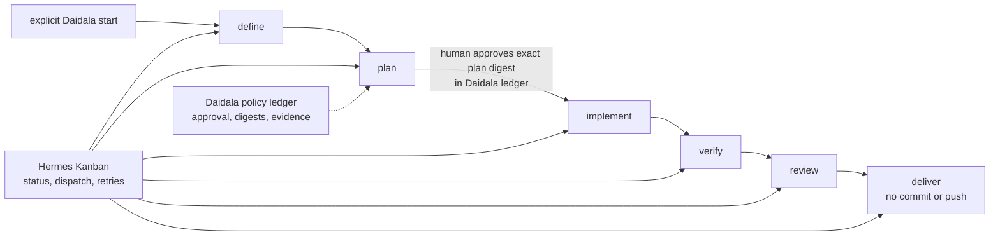

# Daidala


Daidala is a Hermes-native AI workshop that moves skill-backed work through
interchangeable workflow packs and one explicit human approval gate—without
introducing a second orchestration server.

> Your daily driver for crafted, human-approved work.

## Why Daidala

**Daidala** (pronounced *DYE-dah-lah*) is an Ancient Greek name for
[skillfully crafted or fashioned works](https://journal.eahn.org/articles/10.5334/ah.239/).
The word belongs to the tradition of Daedalus, the legendary maker, and the
wondrous craft associated with Hephaestus.

The name fits a Hermes-native AI workshop built around disciplined craft rather
than unconstrained automation. Daidala brings specialist agents and skills into
an ordered process: a goal is defined, planned, approved by a human, implemented
in isolation, verified, reviewed, and delivered with evidence. Skills provide
the craft, workflow constraints shape the work, and Hermes supplies the agent
runtime.

## What Daidala adds to Hermes

Plain Hermes Kanban already owns cards, dependencies, profiles, retries,
comments, and worker runs. Daidala adds pack-defined workflow policy around
that runtime:

- **Workflow packs** map exact skills onto `define`, `plan`, `implement`,
  `verify`, `review`, and `deliver`.
- **Provenance** pins external skill sources, revisions, names, and complete
  directory digests.
- **Approval integrity** binds human authorization to the SHA-256 digest of one
  complete plan revision.
- **Git safety** rejects a dirty target and performs implementation in one
  Daidala-owned detached worktree.
- **Evidence** retains definitions, plans, immutable diffs, changed paths,
  verification output, and review artifacts.
- **Conservative delivery** reports a reviewed diff with `committed: false` and
  `pushed: false`.
- **Pack neutrality** keeps pack-specific skill mappings in YAML rather than
  branching the Python engine.
- **Native surfaces** expose 12 agent tools, three bundled skills, the shared
  `hermes daidala`/`daidala` CLI, and an optional authenticated dashboard tab.

## How it integrates

Daidala loads in-process as a Hermes plugin. It creates linked cards on an
existing Hermes Kanban board, assigns every executable stage to an explicit
Hermes profile, and lets the gateway's existing Kanban dispatcher run ready
cards. Daidala's SQLite data is only a policy and artifact ledger; Hermes
Kanban remains lifecycle truth.

Daidala adds no MCP server, HTTP daemon, dashboard server, scheduler, model
client, or nested `hermes chat` process. Its optional `/daidala` extension runs
inside the existing Hermes dashboard; normal Kanban CLI, `/kanban`, and gateway
operations remain available for progress and recovery.



## Start a first workflow

Prerequisites:

- Hermes Agent v0.18.2 or v0.19.0 within `>=0.18.2,<0.20.0`;
- Daidala installed and enabled in the profile that owns the workflow;
- an existing named Kanban board;
- the selected pack's exact skills installed in every assigned worker profile;
- the Hermes gateway running so its Kanban dispatcher can claim ready cards;
- a clean local Git target repository.

```bash
hermes plugins install forgegod/daidala --enable
hermes daidala packs check aidlc
hermes kanban boards create project-board --name "Project board"
hermes gateway run
```

Run the gateway in a separate terminal on WSL. Then start explicitly with one
profile for every stage:

```bash
hermes daidala start /absolute/path/to/repo "Implement the requested change" \
  --board project-board \
  --default-profile default \
  --pack aidlc \
  --workflow-id first-workflow
```

The command validates policy inputs and creates `define → plan`; it does not
start another scheduler. Observe the board with `hermes kanban --board
project-board watch`, the dashboard, or `/kanban`. After the plan card records a
plan artifact, approve that exact digest:

```bash
hermes daidala approve first-workflow <64-character-plan-digest>
```

A generic `hermes kanban unblock` is not approval; there is no approval card to
promote or dispatch. Successful Daidala approval records the ledger gate and
creates `implement → verify → review → deliver`, parented from `plan`, in one
persistent worktree. Use `hermes daidala status first-workflow` for combined
policy facts and live card status; use normal Kanban comments, reassignment, and
unblock for worker recovery.

See [Getting started](docs/00-getting-started.md) for the complete walkthrough,
including pack setup, optional stage-specific profiles, recovery, and delivery.

## Trigger and routing model

A workflow starts only through an explicit Daidala start action: the verified
operator CLI above or an agent calling `daidala_start`. Cron is not required
and is not part of Daidala's runtime. It may send a future prompt that asks an
agent to perform the same explicit start, but Daidala owns no cron job, daemon,
or polling loop.

The global Hermes `kanban.orchestrator_profile` limitation tracked in
[NousResearch/hermes-agent#34977](https://github.com/NousResearch/hermes-agent/issues/34977)
does not route Daidala stages. Daidala selects the board explicitly, assigns
every executable card to an explicit profile, and creates the graph directly
instead of asking Hermes goal decomposition to choose an orchestrator profile.

## Support and limits

- Supported hosts: exact Hermes Agent v0.18.2 and v0.19.0 on Python 3.11,
  bounded by `>=0.18.2,<0.20.0` for local/single-host installations.
- Public installation: `hermes plugins install forgegod/daidala --enable` is
  verified from merged remote `main` on a fresh Hermes v0.19.0 profile.
- Supported entry points: native `hermes daidala`, standalone diagnostics,
  12 agent-facing plugin tools, three qualified bundled skills, and the
  optional authenticated Hermes dashboard extension.
- Packs: Addyosmani `agent-skills` and the bundled AI-DLC v1.0.1 adapter.
- Unattended runtime: the existing Hermes gateway Kanban dispatcher only.
- Delivery never commits, pushes, deploys, or publishes without separate
  authorization.
- Daidala does not copy secrets into artifacts and does not read or write the
  Hermes Kanban database.

## Development and documentation

Start with the [documentation index](docs/README.md). Runtime claims and
compatibility evidence are recorded in the
[Hermes integration guide](docs/08-hermes-integration.md); development commands
and repository verification live in [AGENTS.md](AGENTS.md).
Release maintainers run the compatibility matrix in `scripts/`; the release
workflow verifies one exact wheel twice on both supported Hermes hosts for
version tags and explicit manual dispatches.

```bash
python -m venv .venv
.venv/bin/pip install -e '.[dev]'
.venv/bin/lefthook install
.venv/bin/pytest
.venv/bin/ruff check .
```

## License

MIT
