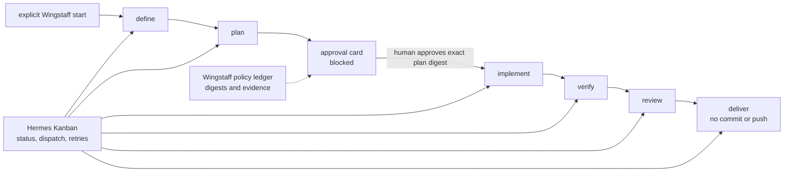

# Wingstaff


Wingstaff is a Hermes-native staff of specialist agents that moves software work through interchangeable workflow packs and one explicit human approval gate—without introducing a second orchestration server.

## What Wingstaff adds to Hermes

Plain Hermes Kanban already owns cards, dependencies, profiles, retries, comments,
and worker runs. Wingstaff adds the software-development policy around that
runtime:

- **Workflow packs** map exact skills onto `define`, `plan`, `implement`,
  `verify`, `review`, and `deliver`.
- **Provenance** pins external skill sources, revisions, names, and complete
  directory digests.
- **Approval integrity** binds human authorization to the SHA-256 digest of one
  complete plan revision.
- **Git safety** rejects a dirty target and performs implementation in one
  Wingstaff-owned detached worktree.
- **Evidence** retains definitions, plans, immutable diffs, changed paths,
  verification output, and review artifacts.
- **Conservative delivery** reports a reviewed diff with `committed: false` and
  `pushed: false`.
- **Pack neutrality** keeps pack-specific skill mappings in YAML rather than
  branching the Python engine.

## How it integrates

Wingstaff loads in-process as a Hermes plugin. It creates linked cards on an
existing Hermes Kanban board, assigns every executable stage to an explicit
Hermes profile, and lets the gateway's existing Kanban dispatcher run ready
cards. Wingstaff's SQLite data is only a policy and artifact ledger; Hermes
Kanban remains lifecycle truth.

Wingstaff adds no MCP server, HTTP daemon, dashboard, scheduler, model client,
or nested `hermes chat` process. Normal Hermes Kanban CLI, dashboard, `/kanban`,
and gateway operations remain the progress and recovery surfaces.



## Start a first workflow

Prerequisites:

- Hermes Agent v0.18.2, the only verified host version;
- Wingstaff installed and enabled in the profile that owns the workflow;
- an existing named Kanban board;
- the selected pack's exact skills installed in every assigned worker profile;
- the Hermes gateway running so its Kanban dispatcher can claim ready cards;
- a clean local Git target repository.

```bash
hermes plugins install forgegod/hermes-wingstaff --enable
hermes wingstaff doctor --pack aidlc
hermes kanban boards create project-board --name "Project board"
hermes gateway run
```

Run the gateway in a separate terminal on WSL. Then start explicitly with one
profile for every stage:

```bash
hermes wingstaff start /absolute/path/to/repo "Implement the requested change" \
  --board project-board \
  --default-profile default \
  --pack aidlc \
  --workflow-id first-workflow
```

The command validates policy inputs and creates `define → plan`; it does not
start another scheduler. Observe the board with `hermes kanban --board
project-board watch`, the dashboard, or `/kanban`. After the plan card records a
plan artifact, approve that exact digest:

```bash
hermes wingstaff approve first-workflow <64-character-plan-digest>
```

A generic `hermes kanban unblock` is not approval. Successful Wingstaff approval
completes the gate and creates `implement → verify → review → deliver` in one
persistent worktree. Use `hermes wingstaff status first-workflow` for combined
policy facts and live card status; use normal Kanban comments, reassignment, and
unblock for worker recovery.

See [Getting started](docs/00-getting-started.md) for the complete walkthrough,
including pack setup, optional stage-specific profiles, recovery, and delivery.

## Trigger and routing model

A workflow starts only through an explicit Wingstaff start action: the verified
operator CLI above or an agent calling `wingstaff_start`. Cron is not required
and is not part of Wingstaff's runtime. It may send a future prompt that asks an
agent to perform the same explicit start, but Wingstaff owns no cron job, daemon,
or polling loop.

The global Hermes `kanban.orchestrator_profile` limitation tracked in
[NousResearch/hermes-agent#34977](https://github.com/NousResearch/hermes-agent/issues/34977)
does not route Wingstaff stages. Wingstaff selects the board explicitly, assigns
every executable card to an explicit profile, and creates the graph directly
instead of asking Hermes goal decomposition to choose an orchestrator profile.

## Support and limits

- Supported host: Hermes Agent v0.18.2 on one local/single-host installation.
- Supported entry points: native `hermes wingstaff`, standalone diagnostics, and
  agent-facing plugin tools.
- Packs: Addyosmani `agent-skills` and the bundled AI-DLC v1.0.1 adapter.
- Unattended runtime: the existing Hermes gateway Kanban dispatcher only.
- Delivery never commits, pushes, deploys, or publishes without separate
  authorization.
- Wingstaff does not copy secrets into artifacts and does not read or write the
  Hermes Kanban database.

## Development and documentation

Start with the [documentation index](docs/README.md). Runtime claims and
compatibility evidence are recorded in the
[Hermes integration guide](docs/08-hermes-integration.md); development commands
and repository verification live in [AGENTS.md](AGENTS.md).
Release maintainers run `python scripts/probe_hermes_compatibility.py`; the
release workflow enforces it for version tags and explicit manual dispatches.

```bash
python -m venv .venv
.venv/bin/pip install -e '.[dev]'
.venv/bin/lefthook install
.venv/bin/pytest
.venv/bin/ruff check .
```

## License

MIT
