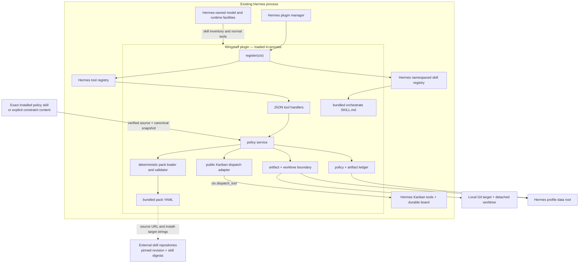
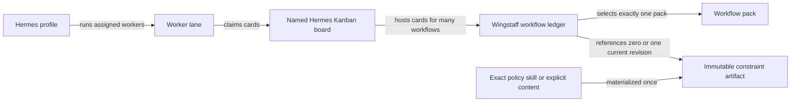
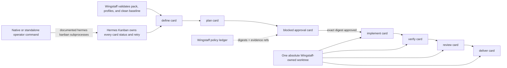

# 01 — Architecture

## Product boundary

Wingstaff is a general Hermes plugin plus bundled resources. Hermes owns the
agent process, model access, tool registry, skill loading, gateway, delegation,
Kanban lifecycle, and cron facilities. Wingstaff adds workflow packs, exact skill
provenance, workflow-scoped constraint artifacts, plan-and-constraint approval,
repository safety, and evidence integrity on top of those host facilities.

Wingstaff is not an MCP server, HTTP service, dashboard service, model provider,
message gateway, scheduler, or nested `hermes chat` launcher.

## Component boundary

Wingstaff has no autonomous execution loop, scheduler, model client, or second
service. Its Kanban adapter calls documented host operations; it never imports
or writes Hermes' board database. Hermes owns card status, assignment, claims,
heartbeats, completion, dependencies, retries, and worker restart. Wingstaff's
SQLite data is a narrow policy and artifact-integrity ledger, not another task
state machine.

## Authority split

| Concern | Authority |
|---|---|
| Board, card status, dependencies, assignment, claims, retries, comments, and run history | Hermes Kanban |
| User-visible progress and recovery | Hermes Kanban CLI, slash command, dashboard, and gateway |
| Pack selection, stage skills, provenance, and compatibility | Wingstaff |
| Workflow constraint identity, immutable policy artifact, projection, and replacement | Wingstaff |
| Repository baseline, owned worktree, and immutable implementation scope | Wingstaff |
| Plan-and-constraint tuple approval, artifact digests, and verification evidence | Wingstaff policy ledger |
| Target commit or push | Unavailable without separate authorization |

No operational transition requires bidirectional status synchronization.
Wingstaff reads Hermes status when presenting a combined view and applies only
Wingstaff-owned policy checks before creating or releasing cards.

## Workflow constraint topology

The topology is composition, not a Hermes parent-child hierarchy:

- One Hermes profile may run workers for many boards and workflows.
- One named board may host cards from many Wingstaff workflows.
- Each Wingstaff workflow selects exactly one board and one pack.
- Each workflow has zero or one current constraint identity and retains every
  historical constraint artifact append-only.
- A reusable policy skill may source many workflows, but it grants no worker
  activation and owns no lifecycle state. Wingstaff verifies and snapshots it;
  later workflow execution reads the immutable workflow artifact.
- Hermes dispatch owns card claims and worker runs. Wingstaff owns policy
  identity, card eligibility, approval binding, and artifact integrity.

## Process boundary

The optional dashboard is a Hermes-owned extension, not another process. Hermes
serves the packaged manifest, browser assets, and authenticated router inside its
existing dashboard process. The router delegates deterministic policy to the
same `WorkflowService`; Hermes Kanban CLI operations remain the host boundary.

Native `hermes wingstaff` is the canonical operator surface. The standalone
`wingstaff` executable shares its parser and handlers for diagnostics and smoke
tests. Neither is a long-running orchestration process.

## Deterministic mechanism and model judgment

The Kanban-native deterministic boundary keeps the implemented pack,
repository, and artifact mechanisms and replaces private lifecycle state with:

- `wingstaff.packs.load_pack()` resolves a conservative bundled pack name;
- `yaml.safe_load()` parses the package resource;
- `validate_pack()` validates schema shape, lifecycle order, skill references,
  and pre-implementation gate placement;
- immutable dataclasses and SQLite enforce policy-ledger invariants, optimistic
  updates, exact plan approval, and artifact integrity;
- exact installed-skill names gate workflow graph creation and validation;
- profile-local artifact paths and detached Git worktrees isolate execution;
- captured diffs, changed paths, command results, and delivery flags remain
  deterministic;
- every plugin handler serializes success or failure as JSON.

Wingstaff calls no model. Hermes profile workers and the selected pack skills
produce definition, plan, implementation, verification, and review judgment.
Workers terminate through `kanban_complete` or `kanban_block`; Wingstaff records
artifact digests, approval, verification evidence, and delivery scope without
declaring a second operational status.

## Release host compatibility

Hermes v0.18.2 preserves worker task bodies through 8,192 characters and visibly
truncates larger bodies. Wingstaff therefore limits canonical constraints to
4,096 UTF-8 bytes and rejects a fully rendered card body over 8,192 characters;
it never silently truncates policy content.

`scripts/probe_hermes_compatibility.py` makes this a release contract rather than
a one-time observation. It checks exact Hermes semantic, build, and upstream
identity, exact policy-skill hashing, public Kanban lifecycle operations, and
both sides of the worker-context boundary in an isolated `HERMES_HOME`. Ordinary
pushes and pull requests use fast regressions; version tags and explicit release
dispatches run the live probe after tests and packaging pass.

## First-release execution policy

The first executable release is constrained to local target repositories. Its
state and lifecycle tools enforce one policy consistently:

- reject a target repository with existing tracked or untracked changes;
- create a fresh Wingstaff-owned Git worktree for implementation;
- produce a reviewed working-tree diff, not an automatic target commit or push;
- require separate authorization before committing or pushing target changes;
- bind one human approval to the complete plan artifact digest;
- invalidate approval whenever that plan changes.

These controls are executable and covered by the cross-pack fixtures. The
support-status table remains authoritative for later capabilities.

## Plugin and package entry points

The repository supports two discovery shapes verified against Hermes v0.18.2:

- the root `plugin.yaml` and root `__init__.py` form the Git-directory plugin
  entry point;
- the `hermes_agent.plugins` entry point in `pyproject.toml` resolves to
  the `wingstaff` module for Python-package discovery. Hermes then calls its
  module-level `register(ctx)` function.

`wingstaff.register(ctx)` uses the documented `register_tool()` and
`register_skill()` context APIs. Hermes documents plugin skills as read-only,
namespaced resources loaded as `plugin:skill`; therefore the registered
`orchestrate` resource is addressed as `wingstaff:orchestrate` when the plugin
name is `wingstaff`.

## Pack neutrality

The Python validator knows lifecycle mechanics, not Addy Osmani-specific skill
semantics. Pack-specific data lives in `wingstaff/packs/*.yaml`. Schema v1 is
intentionally strict: every pack uses the same six ordered stages, and each
stage supplies external or plugin-bundled skill references. External skills
remain the default; bundled references exist for licensed adapters whose
upstream source does not ship Hermes Agent Skills.

Adding a pack-specific conditional to `wingstaff/packs.py` would violate this
boundary. Extend the schema only for a capability shared by packs, then validate
that capability generically.

## Source of truth

| Contract | Current source or migration target | Verification |
|---|---|---|
| Plugin declarations | `plugin.yaml`, `pyproject.toml` | `tests/test_installation.py`; live directory and entry-point probes |
| Registration | `wingstaff/__init__.py` | `tests/test_plugin.py` fake-context assertions |
| Tool schema and JSON boundary | `wingstaff/schemas.py`, `wingstaff/tools.py` | `tests/test_plugin.py` |
| Policy ledger and persistence | `wingstaff/state.py`, `wingstaff/workflow.py`, `wingstaff/store.py` | State, policy, persistence, and restart tests |
| Kanban graph and execution isolation | `wingstaff/service.py`, `wingstaff/kanban.py`, `wingstaff/execution.py` | Fake-host graph/recovery tests and isolated Hermes lifecycle probes |
| Worktree cleanup and rollback | `wingstaff/service.py`, `wingstaff/execution.py` | Cross-pack delivery and cancellation tests |
| Pack schema and invariants | `wingstaff/packs.py` | `tests/test_packs.py` |
| Addy Osmani mapping | `wingstaff/packs/addyosmani.yaml` | Pack load and CLI validation |
| AI-DLC mapping | `wingstaff/packs/aidlc.yaml`, `wingstaff/skills/aidlc-adapter/` | Pack, fixture-workflow, registration, and wheel tests |
| Bundled procedures | `wingstaff/skills/*/SKILL.md` | Registration and packaging tests |
| Hermes extension behavior | [official plugin guide](https://hermes-agent.nousresearch.com/docs/developer-guide/plugins) | Upstream documentation plus the v0.18.2 compatibility probe |
