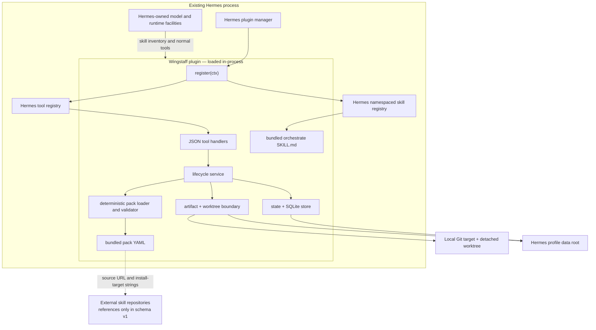
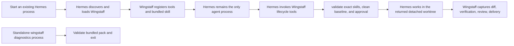

# 01 — Architecture

## Product boundary

Wingstaff is a general Hermes plugin plus bundled resources. Hermes owns the
agent process, model access, tool registry, skill loading, gateway, delegation,
Kanban, and cron facilities. Wingstaff adds pack validation, deterministic
workflow state, profile-local persistence, approval gates, artifact capture,
and detached-worktree coordination on top of those host facilities.

Wingstaff is not an MCP server, HTTP service, dashboard service, model provider,
message gateway, scheduler, or nested `hermes chat` launcher.

## Component boundary

Wingstaff has no autonomous execution loop, Kanban adapter, scheduler, model
client, or second service. Hermes drives the registered tools and performs
model-authored implementation and verification work in the returned worktree.

## Process boundary

The standalone `wingstaff` executable is package diagnostics, not the operator
orchestration surface and not a long-running process.

## Deterministic mechanism and model judgment

The implemented deterministic boundary includes:

- `wingstaff.packs.load_pack()` resolves a conservative bundled pack name;
- `yaml.safe_load()` parses the package resource;
- `validate_pack()` validates schema shape, lifecycle order, skill references,
  and pre-implementation gate placement;
- immutable dataclasses and SQLite enforce lifecycle state, optimistic updates,
  exact plan approval, and terminal failure;
- exact installed-skill names gate draft creation and validation;
- profile-local artifact paths and detached Git worktrees isolate execution;
- captured diffs, changed paths, command results, and delivery flags remain
  deterministic;
- every plugin handler serializes success or failure as JSON.

Wingstaff calls no model. Hermes and the selected pack skills produce
definition, plan, implementation, and review judgment. Wingstaff records those
artifacts and keeps transitions, digests, validation, verification evidence,
and delivery scope deterministic.

## First-release execution policy

The first executable release is constrained to local target repositories. Its
state and lifecycle tools enforce one policy consistently:

- reject a target repository with existing tracked or untracked changes;
- create a fresh Wingstaff-owned Git worktree for implementation;
- produce a reviewed working-tree diff, not an automatic target commit or push;
- require separate authorization before committing or pushing target changes;
- bind one human approval to the complete plan artifact digest;
- invalidate approval whenever that plan changes.

These controls are executable and covered by the Phase 5 fixture. The
support-status table remains authoritative for later capabilities.

## Plugin and package entry points

The repository supports two discovery shapes verified against Hermes v0.18.2:

- the root `plugin.yaml` and root `__init__.py` form the Git-directory plugin
  entry point;
- the `hermes_agent.plugins` entry point in `pyproject.toml` resolves to
  the `wingstaff` module for Python-package discovery. Hermes then calls its
  module-level `register(ctx)` function.

`wingstaff.register(ctx)` uses the documented `register_tool()` and
`register_skill()` context APIs. Hermes documents plugin skills as read-only,
namespaced resources loaded as `plugin:skill`; therefore the registered
`orchestrate` resource is addressed as `wingstaff:orchestrate` when the plugin
name is `wingstaff`.

## Pack neutrality

The Python validator knows lifecycle mechanics, not Addy Osmani-specific skill
semantics. Pack-specific data lives in `wingstaff/packs/*.yaml`. Schema v1 is
intentionally strict: every pack uses the same six ordered stages, and each
stage supplies its own external skill references.

Adding a pack-specific conditional to `wingstaff/packs.py` would violate this
boundary. Extend the schema only for a capability shared by packs, then validate
that capability generically.

## Source of truth

| Contract | Source | Verification |
|---|---|---|
| Plugin declarations | `plugin.yaml`, `pyproject.toml` | `tests/test_installation.py`; live directory and entry-point probes |
| Registration | `wingstaff/__init__.py` | `tests/test_plugin.py` fake-context assertions |
| Tool schema and JSON boundary | `wingstaff/schemas.py`, `wingstaff/tools.py` | `tests/test_plugin.py` |
| Workflow state and persistence | `wingstaff/state.py`, `wingstaff/store.py` | `tests/test_workflow.py`, `tests/test_store.py` |
| Lifecycle and execution isolation | `wingstaff/service.py`, `wingstaff/execution.py` | `tests/test_execution.py`, `tests/test_tools.py` |
| Pack schema and invariants | `wingstaff/packs.py` | `tests/test_packs.py` |
| Addy Osmani mapping | `wingstaff/packs/addyosmani.yaml` | Pack load and CLI validation |
| Bundled procedure | `wingstaff/skills/orchestrate/SKILL.md` | Registration test and live explicit load |
| Hermes extension behavior | [official plugin guide](https://hermes-agent.nousresearch.com/docs/developer-guide/plugins) | Upstream documentation plus the v0.18.2 compatibility probe |
