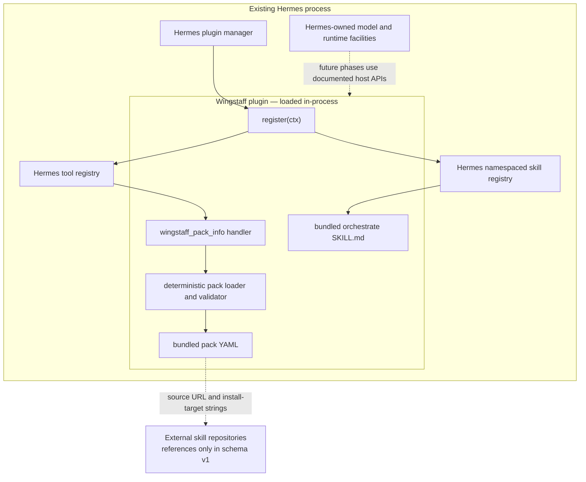
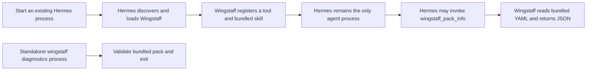

# 01 — Architecture

## Product boundary

Wingstaff is a general Hermes plugin plus bundled resources. Hermes owns the
agent process, model access, tool registry, skill loading, gateway, delegation,
Kanban, and cron facilities. Wingstaff adds pack validation and, in later
phases, deterministic workflow state and coordination on top of those host
facilities.

Wingstaff is not an MCP server, HTTP service, dashboard service, model provider,
message gateway, scheduler, or nested `hermes chat` launcher.

## Component boundary

The bootstrap has no workflow engine, state store, worktree manager, Kanban
adapter, scheduler integration, or autonomous execution loop. Those components
must not be inferred from the pack lifecycle data.

## Process boundary

The standalone `wingstaff` executable is package diagnostics, not the operator
orchestration surface and not a long-running process.

## Deterministic mechanism and model judgment

The implemented deterministic boundary is narrow:

- `wingstaff.packs.load_pack()` resolves a conservative bundled pack name;
- `yaml.safe_load()` parses the package resource;
- `validate_pack()` validates schema shape, lifecycle order, skill references,
  and pre-implementation gate placement;
- immutable dataclasses expose the validated runtime view;
- `wingstaff.tools.pack_info()` serializes success or failure as JSON.

The bootstrap calls no model. The bundled orchestration skill describes
where future model judgment belongs: producing definition and plan artifacts,
then implementation and review work after approval. Future runtime code must
keep transitions, digests, validation, and verification evidence deterministic.

## First-release execution policy

The first executable release is constrained to local target repositories. Its
future state and lifecycle tools must enforce one policy consistently:

- reject a target repository with existing tracked or untracked changes;
- create a fresh Wingstaff-owned Git worktree for implementation;
- produce a reviewed working-tree diff, not an automatic target commit or push;
- require separate authorization before committing or pushing target changes;
- bind one human approval to the complete plan artifact digest;
- invalidate approval whenever that plan changes.

These are binding design inputs for the state model, not implemented bootstrap
features. The support-status table remains authoritative for runtime
availability.

## Plugin and package entry points

The repository supports two discovery shapes verified against Hermes v0.18.2:

- the root `plugin.yaml` and root `__init__.py` form the Git-directory plugin
  entry point;
- the `hermes_agent.plugins` entry point in `pyproject.toml` resolves to
  the `wingstaff` module for Python-package discovery. Hermes then calls its
  module-level `register(ctx)` function.

`wingstaff.register(ctx)` uses the documented `register_tool()` and
`register_skill()` context APIs. Hermes documents plugin skills as read-only,
namespaced resources loaded as `plugin:skill`; therefore the registered
`orchestrate` resource is addressed as `wingstaff:orchestrate` when the plugin
name is `wingstaff`.

## Pack neutrality

The Python validator knows lifecycle mechanics, not Addy Osmani-specific skill
semantics. Pack-specific data lives in `wingstaff/packs/*.yaml`. Schema v1 is
intentionally strict: every pack uses the same six ordered stages, and each
stage supplies its own external skill references.

Adding a pack-specific conditional to `wingstaff/packs.py` would violate this
boundary. Extend the schema only for a capability shared by packs, then validate
that capability generically.

## Source of truth

| Contract | Source | Verification |
|---|---|---|
| Plugin declarations | `plugin.yaml`, `pyproject.toml` | `tests/test_installation.py`; live directory and entry-point probes |
| Registration | `wingstaff/__init__.py` | `tests/test_plugin.py` fake-context assertions |
| Tool schema and JSON boundary | `wingstaff/schemas.py`, `wingstaff/tools.py` | `tests/test_plugin.py` |
| Pack schema and invariants | `wingstaff/packs.py` | `tests/test_packs.py` |
| Addy Osmani mapping | `wingstaff/packs/addyosmani.yaml` | Pack load and CLI validation |
| Bundled procedure | `wingstaff/skills/orchestrate/SKILL.md` | Registration test and live explicit load |
| Hermes extension behavior | [official plugin guide](https://hermes-agent.nousresearch.com/docs/developer-guide/plugins) | Upstream documentation plus the v0.18.2 compatibility probe |
