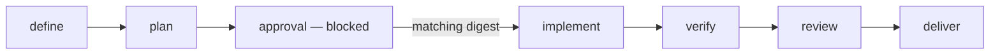

# 02 — Policy ledger and Kanban state

Hermes Kanban is the only operational state machine. Wingstaff persists one
deterministic policy-ledger record per workflow. Judgment stays in Hermes and
pack skills; Python owns identity, provenance, plan approval, repository safety,
artifact integrity, and optimistic concurrency.

The policy and artifact ledger, full approval-gated Kanban graph, and combined
read-only status view are implemented. Stage worker handoffs and recovery remain
the next implementation boundary.

## Identity and baseline

A workflow records:

- a path-safe workflow ID;
- an absolute local target repository root;
- the requested goal and selected pack revision;
- the clean target baseline commit;
- selected board slug and expanded stage-to-profile mapping;
- deterministic stage-to-card IDs and idempotency keys;
- creation and last-update timestamps.

`wingstaff_start` validates every exact pack skill, every resolved profile, the
named board, and the clean baseline before creating the linked `define` and
`plan` cards. Failed policy validation creates no graph.

## Operational status

Wingstaff stores no `draft`, `running`, `blocked`, or `completed` field. Card
status is read from the workflow's named Hermes board. Wingstaff may return a
combined read-only view containing Kanban card statuses beside policy facts, but
it never mirrors those statuses into its ledger.

| Fact | Source |
|---|---|
| Card readiness, running, blocking, completion, retry, and archive state | Hermes Kanban |
| Current approved plan digest and approval actor/time | Wingstaff ledger |
| Baseline, worktree ownership, and immutable changed-path manifest | Wingstaff ledger |
| Worker summaries, comments, run outcomes, and retry history | Hermes Kanban |
| Artifact bytes, digests, and exact verification evidence | Wingstaff artifact store and ledger |

## Card graph

Cards use idempotency key `wingstaff:<workflow-id>:<plan-revision>:<stage>`.
The initial `define` and `plan` cards use revision zero. Post-approval cards use
the approved plan digest's ledger revision, so a changed plan cannot reuse an
authorized graph. Hermes parent links own readiness promotion.

## Transition ownership

| Transition | Hermes Kanban event | Wingstaff policy check |
|---|---|---|
| Start accepted | `created` for `define` and dependent `plan` | Named board, clean baseline, exact skills, and all expanded profiles validate |
| Definition begins or succeeds | `claimed`, then `completed` | `wingstaff.handoff/v1` definition artifact reference and digest validate |
| Plan becomes runnable or succeeds | `promoted`, `claimed`, then `completed` | Definition digest matches; plan artifact reference and digest validate |
| Human gate appears | `created` with blocked status and `plan` parent | Current plan digest is persisted before creation |
| Approval succeeds | `completed` on the approval card | Supplied digest exactly matches the current plan and approval is recorded first |
| Post-gate graph appears | `created` for `implement`, `verify`, `review`, and `deliver` | Approval, baseline, plan revision, profiles, exact skills, and worktree all validate |
| Stage succeeds | `completed` | Handoff schema, plan revision, stage artifact, and evidence digest validate |
| Stage needs intervention | `blocked` or `dependency_wait` | Structured comment names the current workflow, revision, evidence, and required decision |
| Operator resumes work | `unblocked` | No approval is inferred; later Wingstaff evidence calls still validate the current revision |
| Plan is replaced | `archived` on obsolete post-gate cards | Approval is cleared and plan revision increments before any new graph |
| Workflow is cancelled | `archived` on nonterminal cards | Only Wingstaff-owned worktree and policy references may be cleaned |

`created`, `promoted`, `claimed`, `completed`, `blocked`, `dependency_wait`,
`unblocked`, and `archived` are Hermes v0.18.2 event kinds. Wingstaff does not
invent parallel transition names.

## Approval integrity

The plan artifact has a SHA-256 digest. `wingstaff_approve` accepts only that
exact current digest. A generic Kanban unblock is interaction, not approval.
Only after Wingstaff records the matching digest may it annotate and complete
the approval card and create the post-gate graph.

Replacing a plan clears approval, increments the plan revision, and makes every
older post-gate card ineligible for Wingstaff evidence submission. Worktree
creation rechecks approval, target cleanliness, and the baseline. Repeating graph
creation reuses the same cards and absolute worktree for that plan revision.

## Persistence and concurrency

`WorkflowStore` persists policy facts in profile-local SQLite. Updates use the
previous `updated_at` as an optimistic concurrency token. A stale writer raises
`StoreError("modified concurrently")`; the service does not auto-retry or hide
the conflict.

Runtime SQLite files and policy-ledger records are never repository artifacts.

## Source of truth

- Contract: this document and the active Kanban-native implementation plan
- Ledger model: `wingstaff/state.py`
- Policy operations: `wingstaff/workflow.py`
- Persistence: `wingstaff/store.py`
- Coordination: `wingstaff/service.py`
- Verification: `tests/test_workflow.py`, `tests/test_store.py`,
  `tests/test_execution.py`
