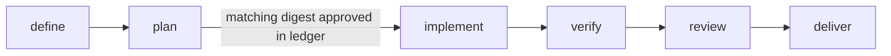

# 02 — Policy ledger and Kanban state

Hermes Kanban is the only operational state machine. Daidala persists one
deterministic policy-ledger record per workflow. Judgment stays in Hermes and
pack skills; Python owns identity, provenance, plan approval, repository safety,
artifact integrity, and optimistic concurrency.

The policy and artifact ledger, full approval-gated Kanban graph, combined
read-only status view, card-scoped worker handoff/recovery contract, and native
and standalone operator-command paths are implemented.

## Identity and baseline

A workflow records:

- a path-safe workflow ID;
- an absolute local target repository root;
- the requested goal and selected pack revision;
- the clean target baseline commit;
- selected board slug and expanded stage-to-profile mapping;
- deterministic stage-to-card IDs and idempotency keys;
- policy revision plus the current nullable constraint revision/digest and source
  provenance;
- creation and last-update timestamps.

`daidala_start` validates every exact pack skill, every resolved profile, the
named board, and the clean baseline before creating the linked `define` and
`plan` cards. Failed policy validation creates no graph.

## Operational status

Daidala stores no `draft`, `running`, `blocked`, or `completed` field. Card
status is read from the workflow's named Hermes board. Daidala may return a
combined read-only view containing Kanban card statuses beside policy facts, but
it never mirrors those statuses into its ledger.

| Fact | Source |
|---|---|
| Card readiness, running, blocking, completion, retry, and archive state | Hermes Kanban |
| Current approved plan digest and approval actor/time | Daidala ledger |
| Current and historical constraint revisions, digests, artifacts, and source provenance | Daidala ledger |
| Baseline, worktree ownership, and immutable changed-path manifest | Daidala ledger |
| Worker summaries, comments, run outcomes, and retry history | Hermes Kanban |
| Artifact bytes, digests, and exact verification evidence | Daidala artifact store and ledger |

## Card graph

Cards use idempotency key `daidala:<workflow-id>:<plan-revision>:<stage>`.
The initial `define` and `plan` cards use revision zero. Post-approval cards use
the approved plan digest's ledger revision, so a changed plan cannot reuse an
authorized graph. The human gate is a Daidala ledger fact, not a Kanban card.
`implement` is linked directly to `plan`; Hermes parent links own readiness
promotion for executable cards.

## Transition ownership

| Transition | Hermes Kanban event | Daidala policy check |
|---|---|---|
| Start accepted | `created` for `define` and dependent `plan` | Named board, clean baseline, exact skills, and all expanded profiles validate |
| Definition begins or succeeds | `claimed`, then `completed` | `daidala.handoff/v1` definition artifact reference and digest validate |
| Plan becomes runnable or succeeds | `promoted`, `claimed`, then `completed` | Definition digest matches; plan artifact reference and digest validate |
| Human gate appears | None; no approval card exists | Current plan and nullable constraint tuple is persisted and exposed for attended approval |
| Approval succeeds | `created` for the post-gate graph only after ledger mutation and worktree creation | Supplied digest matches the current plan and approval binds the current nullable constraint identity before host mutation |
| Post-gate graph appears | `created` for `implement`, `verify`, `review`, and `deliver` | Approval, baseline, plan revision, profiles, exact skills, and worktree all validate |
| Stage succeeds | `completed` | Handoff schema, plan revision, stage artifact, and evidence digest validate |
| Stage needs intervention | `blocked` or `dependency_wait` | Structured comment names the current workflow, revision, evidence, and required decision |
| Operator resumes work | `unblocked` | No approval is inferred; later Daidala evidence calls still validate the current revision |
| Plan is replaced | `archived` on obsolete post-gate cards | Approval is cleared and plan revision increments before any new graph |
| Constraints are replaced | `archived` on obsolete cards | Policy revision and immutable constraint artifact become durable before owned-worktree cleanup and fresh define/plan creation |
| Workflow is cancelled | `archived` on nonterminal cards | Only Daidala-owned worktree and policy references may be cleaned |

`created`, `promoted`, `claimed`, `completed`, `blocked`, `dependency_wait`,
`unblocked`, and `archived` are Hermes v0.18.2 event kinds. Daidala does not
invent parallel transition names.

## Approval integrity

The plan artifact has a SHA-256 digest. `daidala_approve` accepts only that
exact current digest. A generic Kanban unblock is interaction, not approval, and
Kanban workers are rejected by the approval tool. Only after Daidala records the
matching tuple may it create the worktree and post-gate graph. Historical
approval-card references remain readable ledger evidence but are never completed,
promoted, or recreated.

Replacing a plan clears approval, increments the plan revision, and makes every
older post-gate card ineligible for Daidala evidence submission. Worktree
creation rechecks approval, target cleanliness, and the baseline. Repeating graph
creation reuses the same cards and absolute worktree for that plan revision.

## Persistence and concurrency

`WorkflowStore` persists policy facts in profile-local SQLite. Updates use the
previous `updated_at` as an optimistic concurrency token. A stale writer raises
`StoreError("modified concurrently")`; the service does not auto-retry or hide
the conflict.

Runtime SQLite files and policy-ledger records are never repository artifacts.

## Source of truth

Dashboard responses are snapshots only. Daidala's ledger owns policy identity,
Hermes Kanban owns live status, and the browser owns neither. Setup and constraint
forms must submit an exact typed request; explicit confirmation and current
digests are revalidated server-side before mutation.

- Contract: this document
- Ledger model: `daidala/state.py`
- Policy operations: `daidala/workflow.py`
- Persistence: `daidala/store.py`
- Coordination: `daidala/service.py`
- Verification: `tests/test_workflow.py`, `tests/test_store.py`,
  `tests/test_execution.py`
