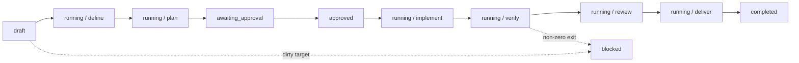

# 02 — Workflow state

Wingstaff persists one deterministic state document per workflow. Judgment stays
in Hermes and pack skills; Python owns transitions, timestamps, approval
digests, artifact references, and terminal outcomes.

## Identity and baseline

A workflow records:

- a path-safe workflow ID;
- an absolute local target repository root;
- the requested goal and selected pack revision;
- the clean target baseline commit;
- creation and last-update timestamps.

`wingstaff_start` creates `draft` state only after every exact pack skill is
available. `wingstaff_validate` records the baseline and moves a clean target to
`running/define`; a dirty target becomes terminal `blocked`.

## Statuses

| Status | Meaning |
|---|---|
| `draft` | Created but target validation has not passed. |
| `running` | The current stage may accept its required output. |
| `awaiting_approval` | The complete plan exists and implementation is paused. |
| `approved` | Human approval matches the current plan digest. |
| `blocked` | Validation or verification failed; terminal. |
| `failed` | Runtime failure; terminal. |
| `completed` | Delivery artifact recorded; terminal. |
| `cancelled` | Operator cancelled a nonterminal workflow; terminal. |

Terminal state cannot be rewound or cancelled. Recovery starts a new workflow;
Wingstaff does not fabricate retries.

## Stage transitions

Every transition rejects timestamps older than `updated_at`. Repeating a
transition is accepted only where the transition contract defines an identical
idempotent result.

## Approval integrity

The plan artifact has a SHA-256 digest. `wingstaff_approve` accepts only that
exact current digest. `wingstaff_modify` replaces the plan reference and clears
approval, so stale approval cannot authorize changed implementation scope.

Worktree creation checks approval again and confirms the target is still clean
and still at the recorded baseline.

After that transition is persisted, Wingstaff creates the implementation card
through Hermes Kanban with idempotency key
`wingstaff:<workflow-id>:implement`. Repeating preparation after interruption
reuses that card and the same persistent worktree. Wingstaff state remains
authoritative for lifecycle and approval; Hermes Kanban remains authoritative
for assignment, claim, heartbeat, completion, and worker recovery.

## Persistence and concurrency

`WorkflowStore` persists JSON state in profile-local SQLite. Updates use the
previous `updated_at` as an optimistic concurrency token. A stale writer raises
`StoreError("modified concurrently")`; the service does not auto-retry or hide
the conflict.

Runtime SQLite files and workflow state are never repository artifacts.

## Source of truth

- Model: `wingstaff/state.py`
- Transitions: `wingstaff/workflow.py`
- Persistence: `wingstaff/store.py`
- Coordination: `wingstaff/service.py`
- Verification: `tests/test_workflow.py`, `tests/test_store.py`,
  `tests/test_execution.py`
