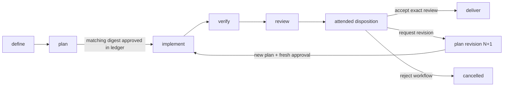

# 02 — Policy ledger and Kanban state

Hermes Kanban is the only operational state machine. Daidala persists one
deterministic policy-ledger record per workflow. Judgment stays in Hermes and
pack skills; Python owns identity, provenance, plan approval, structured review
validation, attended disposition identity, repository safety, artifact integrity,
and optimistic concurrency.

The policy and artifact ledger, full approval-gated Kanban graph, combined
read-only status view, card-scoped worker handoff/recovery contract, and native
and standalone operator-command paths are implemented.

## Identity and baseline

A workflow records:

- a path-safe workflow ID;
- an absolute local target repository root;
- the requested goal and selected pack revision;
- the clean target baseline commit;
- selected board slug and expanded stage-to-profile mapping;
- deterministic stage-to-card IDs and idempotency keys;
- policy revision plus the current nullable constraint revision/digest and source
  provenance;
- creation and last-update timestamps.

`daidala_start` validates every exact pack skill, every resolved profile, the
named board, and the clean baseline before creating the linked `define` and
`plan` cards. Failed policy validation creates no graph.

## Operational status

Daidala stores no `draft`, `running`, `blocked`, or `completed` field. Card
status is read from the workflow's named Hermes board. Daidala may return a
combined read-only view containing Kanban card statuses beside policy facts, but
it never mirrors those statuses into its ledger.

| Fact | Source |
|---|---|
| Card readiness, running, blocking, completion, retry, and archive state | Hermes Kanban |
| Current approved plan digest and approval actor/time | Daidala ledger |
| Source-bound plan `approval_summary` and summary digest | Daidala artifact reference |
| Current structured review, exact attended disposition, and immutable historical review tuples | Daidala ledger |
| `revision_request`, `successor_packet` identity, and retry checkpoints | Daidala ledger and artifact store |
| Current and historical constraint revisions, digests, artifacts, and source provenance | Daidala ledger |
| Baseline, worktree ownership, and immutable changed-path manifest | Daidala ledger |
| Worker summaries, comments, run outcomes, and retry history | Hermes Kanban |
| Artifact bytes, digests, and exact verification evidence | Daidala artifact store and ledger |

## Artifact identity and availability

An artifact reference in the workflow ledger is immutable: its opaque selector,
kind, revision, recorded path, size, media type, and SHA-256 digest do
not change when storage availability changes. Artifact access resolves that
identity as either `active` bytes at the recorded workflow path or `archived`
bytes in one exact verified workflow archive. It never rewrites the ledger path,
accepts an operator filesystem path as a selector, or labels one revision as
latest.

The profile-local curator state records active, stale, pinned, and archived
availability separately from the policy ledger. A published archive lives below
`artifact-archives/<workflow-id>/` in the resolved Daidala data root and carries
both the policy-neutral integrity manifest and curator manifest. Publication and
all member digests verify before matching active source files are removed.

Restore verifies the same archive and copies its members only below
`artifact-restores/<workflow-id>/<archive-id>/`. That recovery copy does not
rewrite historical ledger paths or delete the archive. Hermes Kanban status and
the workflow's delivered/cancelled outcome are unchanged by curation.

## Card graph

```mermaid
flowchart LR
    D["define"] --> P["plan"]
    P -->|"matching digest approved in ledger"| I["implement"]
    I --> V["verify"]
    V --> R["review"]
    R --> HD["attended disposition"]
    HD -->|"accept exact review"| DL["deliver"]
    HD -->|"request revision"| PN["plan revision N+1"]
    PN -->|"new plan + fresh approval"| I
    HD -->|"reject workflow"| X["cancelled"]
```

Cards use idempotency key
`daidala:<workflow-id>:<plan-revision>:<policy-revision>:<constraint-digest-or-none>:<stage>`.
The initial `define` and `plan` cards use revision zero. Post-approval cards use
the approved plan digest's ledger revision, so a changed plan cannot reuse an
authorized graph. Constraint replacement also changes the policy and constraint
components. The plan-approval and review-disposition gates are Daidala ledger
facts, not Kanban cards.
`implement` is linked directly to `plan`; Hermes parent links own readiness
promotion for executable cards.

## Transition ownership

| Transition | Hermes Kanban event | Daidala policy check |
|---|---|---|
| Start accepted | `created` for `define` and dependent `plan` | Named board, clean baseline, exact skills, and all expanded profiles validate |
| Definition begins or succeeds | `claimed`, then `completed` | `daidala.handoff/v1` definition artifact reference and digest validate |
| Plan becomes runnable or succeeds | `promoted`, `claimed`, then `completed` | Definition digest matches; plan artifact reference and digest validate |
| Human gate appears | None; no approval card exists | Current plan and nullable constraint tuple is persisted and exposed for attended approval |
| Approval succeeds | `created` for the post-gate graph only after ledger mutation and worktree creation | Supplied digest matches the current plan and approval binds the current nullable constraint identity before host mutation |
| Post-gate graph appears | `created` for `implement`, `verify`, and `review` | Approval, baseline, plan revision, profiles, exact skills, and worktree all validate |
| Automated review succeeds | `completed` for an accepted review or `blocked` with `review-required:` otherwise | Structured review binds the exact implementation, passing verification, activation, and current card tuple; blocking findings prohibit accepted outcome |
| Attended review is accepted | `created` for `deliver` | Exact current review digest and preview digest are fresh; accepted review has no blocking findings; Kanban-worker authority is rejected |
| Revision is requested | recorded post-gate card IDs are archived; one revision-addressed `plan` card parented to the source review card is created | Canonical revision request and successor packet persist before archive and owned-worktree release; current approval/evidence moves to immutable history |
| Revisioned plan succeeds | no implementation card yet | `plan-N/plan.md` resolves the request and exposes a new exact approval tuple |
| Stage succeeds | `completed` | Handoff schema, plan revision, stage artifact, and evidence digest validate |
| Stage needs intervention | `blocked` or `dependency_wait` | Structured comment names the current workflow, revision, evidence, and required decision |
| Operator resumes work | `unblocked` | No approval is inferred; later Daidala evidence calls still validate the current revision |
| Plan is replaced or review requests revision | `archived` on obsolete post-gate cards | Approval is cleared and plan revision increments before any new graph; review-driven replacement also preserves the exact disposition and successor packet |
| Constraints are replaced | `archived` on obsolete cards | Policy revision and immutable constraint artifact become durable before owned-worktree cleanup and fresh define/plan creation |
| Workflow is cancelled | `archived` on nonterminal cards | Only Daidala-owned worktree and policy references may be cleaned |

`created`, `promoted`, `claimed`, `completed`, `blocked`, `dependency_wait`,
`unblocked`, and `archived` are Hermes v0.18.2 event kinds. Daidala does not
invent parallel transition names.

## Approval integrity

The plan artifact has a SHA-256 digest. `daidala_approve` accepts only that
exact current digest. A generic Kanban unblock is interaction, not approval, and
Kanban workers are rejected by the approval tool. Only after Daidala records the
matching tuple may it create the worktree and post-gate graph. Historical
approval-card references remain readable ledger evidence but are never completed,
promoted, or recreated. `WorkflowStage.APPROVAL` remains for that serialized
history; new workflows create no approval `CardReference`.

Structured review is advisory evidence. `accept_delivery`, `request_revision`,
and `reject_workflow` bind the exact current review, implementation, passing
verification, plan, policy, and nullable constraint tuple. A stale digest or
Kanban-worker caller fails before mutation. Blocking findings cannot be accepted;
the operator challenges judgment through a review-card comment and unblock.

A revision request writes immutable intent and successor packets first, then
archives only recorded current post-gate cards and releases only the owned
worktree. Prior plans, implementation, verification, review, disposition, and
card history remain readable. The new Plan card uses revision N+1; plan recording
resolves the request, while fresh approval alone authorizes a new worktree and
`implement → verify → review` graph. Retries use durable archive/worktree markers
and idempotent card identity instead of rewinding a stage.
Strict `verification_history`, `review_history`,
`review_disposition_history`, and `revision_requests` collections retain those
tuples append-only across plan or constraint revision.

## Persistence and concurrency

`WorkflowStore` persists policy facts in profile-local SQLite. Updates use the
previous `updated_at` as an optimistic concurrency token. A stale writer raises
`StoreError("modified concurrently")`; the service does not auto-retry or hide
the conflict.

Runtime SQLite files and policy-ledger records are never repository artifacts.

## Source of truth

Dashboard responses are snapshots only. Daidala's ledger owns policy identity,
Hermes Kanban owns live status, and the browser owns neither. Setup and constraint
forms must submit an exact typed request; explicit confirmation and current
digests are revalidated server-side before mutation. Dashboard review disposition
uses the same server-derived exact evidence and preview-confirm authority as the
CLI; a revision request reopens only the successor plan's exact approval decision.

- Contract: this document
- Ledger model: `daidala/state.py`
- Policy operations: `daidala/workflow.py`
- Persistence: `daidala/store.py`
- Coordination: `daidala/service.py`
- Artifact resolution: `daidala/artifact_access.py`
- Archive transport and curation: `daidala/archive_io.py`,
  `daidala/artifact_curator.py`
- Verification: `tests/test_workflow.py`, `tests/test_store.py`,
  `tests/test_execution.py`
