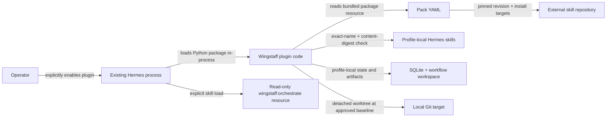

# 06 — Security and trust boundaries

This document covers the plugin, persisted workflow, executable worktree, and
pinned external-skill installation boundary. Kanban, cron, and target
commit/push remain unavailable and are not claimed as current protection.

## Current trust boundaries

A general plugin executes Python inside the Hermes process and therefore shares
that process's privileges. Hermes plugins are opt-in, and project-local plugins
require a separate trust opt-in according to the
[official plugin documentation](https://hermes-agent.nousresearch.com/docs/user-guide/features/plugins).
Review the repository and package provenance before enabling Wingstaff.

Wingstaff's standalone CLI resolves pack source `HEAD` and can invoke explicit
`hermes skills install … --yes` commands after an unblocked plan. It does not
access a model, open sockets, start services, commit, or push. Hermes loads
skills and produces artifacts; normal Hermes tools perform implementation and
verification in the Wingstaff-owned detached worktree.

## Implemented controls

- Pack lookup accepts only alphanumeric-and-hyphen slugs and resolves resources
  inside the installed `wingstaff` package.
- YAML is parsed with `yaml.safe_load()`.
- Pack structure, stage order, source publisher/repository, full commit,
  bounded Hermes version, per-skill complete-directory digest,
  skill-name/install-target agreement, and gate placement are validated before
  a runtime pack object is returned.
- Runtime pack dataclasses are frozen.
- `wingstaff_pack_info` catches `PackError` and returns a JSON string rather than
  raising across the plugin boundary.
- External skill bodies are not vendored into this package.
- Workflow state, artifacts, approval, worktrees, captured diffs, verification
  evidence, and delivery manifests are durable under the resolved profile data
  root.
- Workflow IDs are validated before they can influence runtime paths.
- Delivery uses the changed-path snapshot captured before verification, so test
  byproducts cannot silently expand reviewed scope.
- Registration uses documented Hermes plugin APIs rather than Hermes internals.

These controls establish configured source and local-content integrity. They do
not provide publisher signatures or prove that upstream instructions are safe
or suitable.

## Human approval boundary

Schema v1 places the human gate after `plan`. Durable approval binds the exact
plan digest, plan modification invalidates approval, and worktree creation
rejects every state except `approved`. The target must still be clean and at the
recorded baseline when implementation starts.

## External skills and supply chain

The Addyosmani pack pins its GitHub repository, full commit, bounded Hermes host
range, exact install targets, and SHA-256 digest of every complete required
skill directory. Dry-run is the default and displays every intended mutation.
Apply uses Hermes' installer, then re-reads profile-local directories and fails
unless names and digests match. Source, version, or content drift blocks
workflow start. Digest mismatches produce update plans; they are never silently
replaced during an active workflow. Kanban cards pin the pack's exact
implementation skill names. Hermes owns loading those names for the assigned
profile; missing context fails closed rather than being substituted.

AI-DLC v1.0.1 is pinned to its upstream commit but ships editor rule files,
not Hermes skills. Wingstaff therefore packages a small MIT-0-attributed
adapter skill and its upstream license. It does not install the rules into a
target repository, import the v2 preview runtime, or delegate lifecycle state
and approval to an upstream state machine.

Hermes v0.18.2 cannot install a repository recursively, so Wingstaff refuses
that request instead of expanding an unreviewed glob. Treat pinned external
skills as untrusted instructions until reviewed; hashes prove equality, not
suitability or publisher identity.

## Secrets and generated state

Wingstaff requires no credentials. Do not add credentials to pack YAML,
bundled skills, artifacts, documentation, tests, or package metadata. Secrets
must remain in Hermes-owned configuration and approval paths, not Wingstaff
artifacts.

The repository must not contain live workflow state, target worktrees, SQLite
databases, model transcripts, generated workspaces, or credentials. Runtime
paths use a Hermes-resolved, profile-aware data root and never hard-code
`~/.hermes`.

The dependency-free release-content check rejects tracked or packaged database,
environment, cache, Hermes-home, and worktree paths plus high-confidence private
key and provider-token signatures. CI runs it against both the Git checkout and
the built wheel. This is a release guard, not a substitute for GitHub secret
scanning or review of model-produced workflow artifacts.

## Worktree rollback and cleanup

Wingstaff removes its detached implementation worktree after successful
delivery and when an operator cancels an active workflow. Removal validates
that the path is an immediate child of Wingstaff's profile-local worktree root;
it refuses arbitrary paths. Delivery artifacts and the immutable captured diff
remain durable, while the target checkout and its baseline commit are untouched.

## Cost and token telemetry

Wingstaff makes no model API call and therefore neither meters tokens nor owns a
cost budget. Hermes profiles, gateway policy, and model providers own those
controls. Reading private Hermes session databases or wrapping `hermes chat` to
manufacture plugin-local telemetry would violate the process and trust boundary.

## Dependency and package audit

The runtime dependency set is deliberately limited to PyYAML; Hermes remains
the separately installed host. Release CI builds both distributions, runs
Twine metadata checks, inspects wheel contents, installs the wheel into an
isolated environment, validates both packs, and runs `pip-audit` over that
resolved runtime environment. Dependency findings block release rather than
being converted into warnings or undocumented exceptions.

## Remaining execution requirements

Current execution proves approval, isolation, blocking verification,
uncommitted delivery, rollback cleanup, and release-content checks. Controls
that remain host-owned or unavailable are:

- command execution follows normal Hermes approval and tool-dispatch paths;
- model/tool secrets are not copied into artifacts or logs by host-owned calls;
- external publisher-signature support if a future host exposes it;
- no Wingstaff server, nested Hermes chat process, or private Hermes database
  coupling is introduced.

The [support-status table](README.md#support-status) is authoritative for which
of these surfaces exists.

## Source of truth

- Manifest and package boundary: `plugin.yaml`, `pyproject.toml`
- Registration: `wingstaff/__init__.py`
- Pack loading and validation: `wingstaff/packs.py`
- Workflow state and persistence: `wingstaff/state.py`, `wingstaff/store.py`
- Worktree and artifact isolation: `wingstaff/execution.py`
- Lifecycle coordination: `wingstaff/service.py`
- Tool error boundary: `wingstaff/tools.py`
- Bundled procedures: `wingstaff/skills/*/SKILL.md`
- Tests: `tests/test_packs.py`, `tests/test_plugin.py`, `tests/test_execution.py`
- Host plugin trust model: [official Hermes plugin documentation](https://hermes-agent.nousresearch.com/docs/user-guide/features/plugins)
