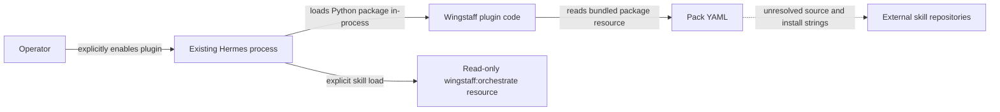

# 06 — Security and trust boundaries

This document covers the bootstrap package and plugin boundary. Workflow
execution, worktree isolation, persisted approval, command execution, Kanban,
cron, and delivery are unavailable, so their planned controls are not claimed
as current protection.

## Current trust boundaries

A general plugin executes Python inside the Hermes process and therefore shares
that process's privileges. Hermes plugins are opt-in, and project-local plugins
require a separate trust opt-in according to the
[official plugin documentation](https://hermes-agent.nousresearch.com/docs/user-guide/features/plugins).
Review the repository and package provenance before enabling Wingstaff.

The bootstrap does not fetch the `source` URL, install external skills, execute
their content, run shell commands, open sockets, start services, mutate a target
repository, access a model, or write workflow state.

## Implemented controls

- Pack lookup accepts only alphanumeric-and-hyphen slugs and resolves resources
  inside the installed `wingstaff` package.
- YAML is parsed with `yaml.safe_load()`.
- Pack structure, stage order, duplicate stage IDs, skill-name/install-target
  agreement, and pre-implementation gate placement are validated before a
  runtime pack object is returned.
- Runtime pack dataclasses are frozen.
- `wingstaff_pack_info` catches `PackError` and returns a JSON string rather than
  raising across the plugin boundary.
- External skill bodies are not vendored into this package.
- Registration uses documented Hermes plugin APIs rather than Hermes internals.

These controls validate local structure. They do not establish upstream
identity, integrity, or suitability.

## Human approval boundary

Schema v1 records `human_gate_after`, and the bundled orchestration skill says
implementation must not start before explicit approval. The validator proves
only that the named gate position is before `implement`.

The bootstrap has no workflow state, plan digest, approval record, transition
enforcement, or implementation tool. Therefore human approval is a documented
contract, not yet an enforceable runtime security control. Do not use the
bootstrap to run autonomous implementation work. Phase 2 owns digest-bound
state; Phase 5 owns the first executable gated workflow.

## External skills and supply chain

The Addy Osmani pack contains an upstream repository URL and fully qualified
install-target strings. Current validation checks only that each target's final
segment equals its declared skill name. It does not:

- resolve or pin a commit or release;
- verify signatures or hashes;
- inspect the upstream skill body;
- ask Hermes whether the target exists;
- install or update the dependency.

Treat external skill repositories as untrusted code and instructions until a
specific revision has been reviewed and mechanically resolved. Silent updates
must not occur during an active workflow; revision resolution is a Phase 6
requirement.

## Secrets and generated state

The bootstrap requires no credentials. Do not add credentials to pack
YAML, bundled skills, documentation, tests, or package metadata. Future secrets
must remain in Hermes-owned configuration and approval paths, not Wingstaff
artifacts.

The repository must not contain live workflow state, target worktrees, SQLite
databases, model transcripts, generated workspaces, or credentials. Runtime
paths in future phases must use a Hermes-resolved, profile-aware data root and
must never hard-code `~/.hermes`.

## Future execution requirements

Before Wingstaff may execute implementation work, the owning phases must prove:

- approval is bound to the exact plan digest and invalidated by plan changes;
- target repositories are local and clean before workflow progress;
- implementation runs in a fresh Wingstaff-owned worktree;
- delivery returns a reviewed diff without automatically committing or pushing
  target changes;
- failed validation or verification blocks progress;
- command execution follows normal Hermes approval and tool-dispatch paths;
- secrets are not copied into artifacts or logs;
- external skill names and revisions are mechanically resolved;
- delivery reports real changed paths and verification evidence;
- no Wingstaff server, nested Hermes chat process, or private Hermes database
  coupling is introduced.

The [support-status table](README.md#support-status) is authoritative for which
of these surfaces exists.

## Source of truth

- Manifest and package boundary: `plugin.yaml`, `pyproject.toml`
- Registration: `wingstaff/__init__.py`
- Pack loading and validation: `wingstaff/packs.py`
- Tool error boundary: `wingstaff/tools.py`
- Bundled procedure: `wingstaff/skills/orchestrate/SKILL.md`
- Tests: `tests/test_packs.py`, `tests/test_plugin.py`
- Host plugin trust model: [official Hermes plugin documentation](https://hermes-agent.nousresearch.com/docs/user-guide/features/plugins)
