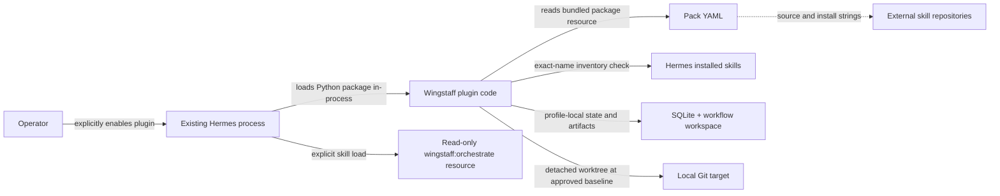

# 06 — Security and trust boundaries

This document covers the plugin, persisted workflow, and first executable
worktree boundary. Kanban, cron, external-skill installation, and target
commit/push remain unavailable and are not claimed as current protection.

## Current trust boundaries

A general plugin executes Python inside the Hermes process and therefore shares
that process's privileges. Hermes plugins are opt-in, and project-local plugins
require a separate trust opt-in according to the
[official plugin documentation](https://hermes-agent.nousresearch.com/docs/user-guide/features/plugins).
Review the repository and package provenance before enabling Wingstaff.

Wingstaff does not fetch pack sources, install external skills, access a model,
open sockets, start services, commit, or push. Hermes loads skills and produces
artifacts; normal Hermes tools perform implementation and verification work in
the Wingstaff-owned detached worktree.

## Implemented controls

- Pack lookup accepts only alphanumeric-and-hyphen slugs and resolves resources
  inside the installed `wingstaff` package.
- YAML is parsed with `yaml.safe_load()`.
- Pack structure, stage order, duplicate stage IDs, skill-name/install-target
  agreement, and pre-implementation gate placement are validated before a
  runtime pack object is returned.
- Runtime pack dataclasses are frozen.
- `wingstaff_pack_info` catches `PackError` and returns a JSON string rather than
  raising across the plugin boundary.
- External skill bodies are not vendored into this package.
- Workflow state, artifacts, approval, worktrees, captured diffs, verification
  evidence, and delivery manifests are durable under the resolved profile data
  root.
- Workflow IDs are validated before they can influence runtime paths.
- Delivery uses the changed-path snapshot captured before verification, so test
  byproducts cannot silently expand reviewed scope.
- Registration uses documented Hermes plugin APIs rather than Hermes internals.

These controls validate local structure. They do not establish upstream
identity, integrity, or suitability.

## Human approval boundary

Schema v1 places the human gate after `plan`. Durable approval binds the exact
plan digest, plan modification invalidates approval, and worktree creation
rejects every state except `approved`. The target must still be clean and at the
recorded baseline when implementation starts.

## External skills and supply chain

The Addy Osmani pack contains an upstream repository URL and fully qualified
install-target strings. Current validation checks only that each target's final
segment equals its declared skill name. It does not:

- resolve or pin a commit or release;
- verify signatures or hashes;
- inspect the upstream skill body;
- ask Hermes whether the target exists;
- install or update the dependency.

Treat external skill repositories as untrusted code and instructions until a
specific revision has been reviewed and mechanically resolved. Silent updates
must not occur during an active workflow; revision resolution is a Phase 6
requirement.

## Secrets and generated state

Wingstaff requires no credentials. Do not add credentials to pack YAML,
bundled skills, artifacts, documentation, tests, or package metadata. Secrets
must remain in Hermes-owned configuration and approval paths, not Wingstaff
artifacts.

The repository must not contain live workflow state, target worktrees, SQLite
databases, model transcripts, generated workspaces, or credentials. Runtime
paths use a Hermes-resolved, profile-aware data root and never hard-code
`~/.hermes`.

## Remaining execution requirements

Current execution proves approval, isolation, blocking verification, and
uncommitted delivery. Remaining phases must prove:

- command execution follows normal Hermes approval and tool-dispatch paths;
- secrets are not copied into artifacts or logs;
- external skill names and revisions are mechanically resolved;
- no Wingstaff server, nested Hermes chat process, or private Hermes database
  coupling is introduced.

The [support-status table](README.md#support-status) is authoritative for which
of these surfaces exists.

## Source of truth

- Manifest and package boundary: `plugin.yaml`, `pyproject.toml`
- Registration: `wingstaff/__init__.py`
- Pack loading and validation: `wingstaff/packs.py`
- Workflow state and persistence: `wingstaff/state.py`, `wingstaff/store.py`
- Worktree and artifact isolation: `wingstaff/execution.py`
- Lifecycle coordination: `wingstaff/service.py`
- Tool error boundary: `wingstaff/tools.py`
- Bundled procedure: `wingstaff/skills/orchestrate/SKILL.md`
- Tests: `tests/test_packs.py`, `tests/test_plugin.py`, `tests/test_execution.py`
- Host plugin trust model: [official Hermes plugin documentation](https://hermes-agent.nousresearch.com/docs/user-guide/features/plugins)
