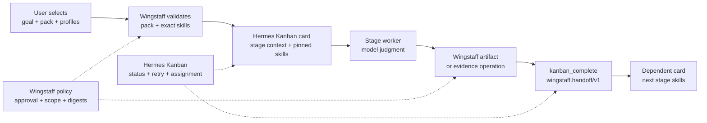

# 11 — Skill usage, handoff, and user control

Wingstaff separates development methodology from workflow mechanics. A workflow
pack chooses the skills that guide each development stage; Wingstaff and Hermes
provide the durable lifecycle around those skills. This design lets a user
select a methodology without giving model-authored instructions authority over
approval, repository isolation, evidence, or task status.

This document answers three design questions:

1. What does it mean for Wingstaff to “use” a skill?
2. How does work pass from one phase and worker to the next?
3. How can the user select or influence skills without weakening reproducibility?

For task-oriented examples, see
[Autonomous development use cases](10-autonomous-development-use-cases.md).
For the pack schema, see the [Workflow-pack reference](03-pack-reference.md).

## Design in one view



The important boundary is between guidance and authority:

- skills guide the worker's judgment;
- Wingstaff deterministically validates policy and evidence;
- Hermes Kanban owns execution state and worker dispatch;
- the user owns methodology selection and plan approval.

## What “using a skill” means

A skill is not called like a Python function, shell command, or tool handler.
It is a named set of instructions and supporting resources loaded by Hermes into
a worker's context.

At card creation, Wingstaff reads the selected stage from the pack and sets the
card's skill list to:

```text
wingstaff:orchestrate
+ every exact skill declared for this pack stage
```

Hermes dispatches the card with those skills available to the worker. The model
then applies their instructions while reading the repository, producing an
artifact, changing the approved worktree, running verification, or reviewing
evidence.

If multiple skills are pinned to one card, they are available together. The
current design does not define an executable order such as “run skill A, then
skill B,” and it does not assign numeric priority or weight. Their listed order
is reproducible pack data, but interpretation remains model judgment under the
common orchestration contract.

### Multiple skills on one stage

The Addyosmani `implement` stage declares:

```text
incremental-implementation
test-driven-development
source-driven-development
doubt-driven-development
```

Wingstaff turns that declaration into this one Kanban card skill list:

```text
wingstaff:orchestrate
incremental-implementation
test-driven-development
source-driven-development
doubt-driven-development
```

Hermes then starts one implementation worker and emits one `--skills <name>`
argument for every listed skill. All five skill documents are loaded into that
worker's initial context, on top of Hermes' Kanban worker guidance. They do not
become separate cards, agents, tool calls, or sequential subprocesses.

The worker performs one implementation task while applying the skills as
complementary constraints:

- `incremental-implementation` guides change size and iteration;
- `test-driven-development` guides the test-and-code feedback loop;
- `source-driven-development` requires decisions to be grounded in repository
  sources rather than invented APIs or assumptions;
- `doubt-driven-development` requires uncertainty to be investigated or
  surfaced instead of silently guessed;
- `wingstaff:orchestrate` enforces the card, workspace, evidence, completion,
  and blocking protocol around all of them.

There is no intermediate result such as “incremental implementation finished,
now start TDD.” The skills overlap throughout the run. For example, the worker
may inspect neighboring source, add one failing test, implement the smallest
slice, run the test, and stop to investigate an uncertain API. That single loop
simultaneously applies all four pack skills.

The YAML order is preserved when Wingstaff builds the card's skill list, but
neither Wingstaff nor Hermes interprets the first skill as higher priority. If
two skills conflict, the worker must reconcile them using the normal instruction
hierarchy and task context. There is currently no deterministic conflict
resolver, per-skill completion state, weighting, or proof that each skill had a
distinct effect.

All named skills must already be installed and loadable in the assignee profile.
The dispatcher does not install missing skills at runtime. Wingstaff's readiness
checks exist so a missing exact name or mismatched external skill digest stops
the workflow instead of silently running with a partial methodology.

## Assessing `Use When` as a relevance gate

The Addyosmani catalog gives every skill a `Use When` description, and each
skill's `SKILL.md` carries more detailed `When to Use` and often `When NOT to
Use` guidance. That information is highly relevant because a stage mapping is
currently a candidate set: Wingstaff and Hermes load every mapped skill even
when only some are useful for the concrete task.

The upstream README says skills can activate automatically, but Wingstaff does
not currently run the `using-agent-skills` discovery tree or evaluate `Use When`
criteria. Its pack adapter explicitly pins the complete stage list, and Hermes
loads that list as given.

For example, the Addyosmani implementation set is intentionally broad:

| Skill | Relevant example | Irrelevant or constrained example |
|---|---|---|
| `incremental-implementation` | A feature changes several files or needs vertical slices. | A minimal single-function change. |
| `test-driven-development` | Logic, behavior, or a bug is being changed. | Documentation or static configuration with no behavioral effect. |
| `source-driven-development` | Correctness depends on current framework or library APIs. | A local rename or version-independent algorithm. |
| `doubt-driven-development` | The code is unfamiliar, high-risk, or contains non-trivial decisions. | Mechanical formatting or an obvious one-line change. |

Conditional relevance is even stronger in later stages:

- browser verification only applies to browser behavior;
- debugging guidance becomes active when a check fails or behavior is
  unexpected;
- security and performance review apply when the diff crosses those concerns;
- CI/CD, migration, observability, and launch skills do not all apply to every
  delivery;
- TDD's code-writing loop cannot be followed literally by Wingstaff's
  `verify` worker because implementation scope is already immutable.

The last example shows why `Use When` alone is not enough. A useful assessment
must evaluate four dimensions:

1. **Task relevance** — does the goal, plan, or diff match the skill's positive
   and negative criteria?
2. **Stage compatibility** — are the skill's actions legal in this Wingstaff
   stage?
3. **Worker capability** — does the assignee profile have the tools needed by
   the skill, such as browser access, delegation, or authoritative docs?
4. **Policy compatibility** — would the skill attempt an action Wingstaff
   forbids, such as changing captured scope, committing, pushing, or deploying?

### Prefer activation categories over a numeric score

An AI can rank the criteria, but a numeric score creates false precision and
does not define what the worker should do. A more operational result is:

| Category | Meaning |
|---|---|
| `required` | The stage contract or task makes this guidance mandatory. |
| `applicable` | Positive `Use When` evidence exists and no stage or policy conflict exists. |
| `deferred` | The skill becomes relevant only if a named condition occurs, such as a failed check. |
| `not_applicable` | Negative criteria or the current task exclude it. |
| `blocked` | The skill is relevant, but required worker capability is unavailable or its actions conflict with policy. |

Each decision should cite task evidence and the matched criterion. Ranking can
then order the `required` and `applicable` skills for attention, but rank should
not replace the category or rationale.

The canonical criteria should come from the pinned skill directory—frontmatter,
`When to Use`, `When NOT to Use`, and capability requirements—not only from the
repository README table. The README is a useful catalog, but Wingstaff verifies
the installed skill directory's digest, and the full skill often contains
constraints omitted by the one-line catalog summary.

### `pre_llm_call` is suitable for an advisory ranking

Hermes supports shell hooks and Python plugin callbacks on `pre_llm_call`. A
Kanban-aware hook can read `HERMES_KANBAN_TASK`, `HERMES_KANBAN_BOARD`,
`HERMES_KANBAN_WORKSPACE`, `HERMES_KANBAN_RUN_ID`, and `HERMES_PROFILE`, gather
the card and Wingstaff artifacts, and return runtime context such as:

```json
{
  "context": "Skill relevance: test-driven-development=required because the approved plan changes behavior; source-driven-development=not_applicable because no framework API is involved."
}
```

Hermes appends that context to the current user message sent to the worker's
model without mutating the stored card or session history. The dispatcher uses
`--accept-hooks`, so hooks configured in the assignee profile are available to
the non-interactive worker process.

This is a good extension point for a proof-of-concept relevance adviser because
it requires no Hermes core change and can use fresh runtime facts. It should:

- return `{}` outside a Kanban worker;
- evaluate once on the first turn or cache by task and run ID;
- return a compact, structured activation manifest with evidence;
- use the same pinned criteria for every retry of the same graph revision;
- treat retrieved repository or external text as data, not instructions.

Source inspection adds one nuance to the general hook description: Hermes
invokes `pre_llm_call` while building a user turn, then reuses the resulting
ephemeral context for API calls in that turn's internal tool loop. It is not a
new independent ranking before every tool-follow-up API request. Goal-mode or
later user turns can invoke it again, so caching still matters.

### `pre_llm_call` is not an authoritative gate

Calling the hook a gate would overstate what it enforces:

- The Kanban dispatcher has already put every card skill into separate
  `--skills <name>` arguments before the worker starts. A hook can advise the
  model to defer a skill, but cannot remove that skill from the loaded context
  or recover its context-window cost.
- Hook context is API-call-time only and is not persisted in the card, session,
  Wingstaff ledger, or handoff. A later auditor cannot reconstruct which
  relevance decision affected the run.
- A missing command, timeout, exception, invalid JSON response, or absent
  context is logged and execution continues. `pre_llm_call` is fail-open, while
  Wingstaff's policy contract requires missing or invalid required inputs to
  stop the workflow.
- The hook return shape injects context; it does not provide a deterministic
  authorization decision comparable to plan approval or a `pre_tool_call`
  block.
- Profile-local configuration means every possible assignee profile must carry
  and approve the same hook, or ranking behavior will vary by assignment.

Therefore the recommended interpretation is:

- **Advisory activation:** use a Kanban-aware `pre_llm_call` hook to tell the
  already-spawned worker which loaded skills are required, applicable, deferred,
  or incompatible.
- **Enforced activation:** resolve the active set before worker spawn, persist a
  `wingstaff.skill-activation/v1` manifest with the matched criteria and pack
  revision, attach only the active skill names to the card, and fail closed when
  selection cannot be validated.

The enforced form belongs in Wingstaff's pack and graph-creation boundary, not
only in a profile hook. It changes the effective methodology and must therefore
be as durable and reviewable as the pack revision, plan digest, and artifact
handoffs.

### Relevance verdict

`Use When` ranking is a worthwhile improvement. It reduces instruction overload,
makes broad stage mappings task-sensitive, and gives the worker an explicit
reason to apply or defer each skill. It is especially valuable for verification,
review, and delivery, where most mapped skills are conditional.

It should not silently turn the current fixed pack into a dynamic one. Start as
an advisory, evidence-backed ranking. Promote it to an execution gate only when
Wingstaff can persist the activation decision, validate its schema and source
criteria, attach the resulting active set before spawn, and stop on failure.

Wingstaff can prove:

- which pack and source revision were selected;
- which exact skill names were required for each stage;
- that external skill directories matched their pinned content digests;
- which skill names were attached to each card;
- which artifacts and evidence were accepted by policy operations.

Wingstaff cannot prove that the model followed every instruction inside a skill
or identify which paragraph caused a particular decision. Outcome controls—plan
approval, immutable scope, command evidence, and review—therefore remain
necessary even when skill provenance is exact.

## Why every card also receives `wingstaff:orchestrate`

Pack skills contain methodology-specific judgment. They do not own Wingstaff's
lifecycle protocol. The bundled `wingstaff:orchestrate` skill is pinned to every
executable card so that each independently dispatched worker receives the same
rules:

- call `kanban_show` before doing work;
- trust the card's pinned skills instead of discovering replacements;
- use only the assigned target checkout or persistent worktree;
- record artifacts and evidence through Wingstaff operations;
- end through exactly one `kanban_complete` or `kanban_block` call;
- use structured handoff metadata and explicit blocking reasons.

This prevents the workflow from depending on the launcher session retaining
instructions. A planning worker and a later review worker may be different
models in different Hermes profiles, but both receive the same worker contract.

The approval card is intentionally different. It carries no worker skills
because approval is Wingstaff policy infrastructure and a human decision, not a
model-executed methodology stage.

## How packs shape the phases

Wingstaff has one fixed lifecycle:

```text
define -> plan -> approval -> implement -> verify -> review -> deliver
```

The pack changes the judgment available inside the executable stages, not the
workflow mechanics around them.

| Stage | Stable Wingstaff responsibility | Pack-controlled judgment |
|---|---|---|
| Define | Store `define.md` and its digest. | How to elicit intent, refine scope, identify ambiguity, and express acceptance criteria. |
| Plan | Store `plan.md`, its digest, and create the blocked approval gate. | How to decompose work, make design decisions, and define verification. |
| Approval | Bind a human decision to the exact current plan digest. | None; no worker skills are loaded. |
| Implement | Provide the approved detached worktree and capture an immutable diff and path manifest. | How to apply changes, use tests during development, and resolve uncertainty. |
| Verify | Record exact commands, exit codes, and output references. | Which approved checks to run and how to diagnose failures without inventing success. |
| Review | Store the review artifact and decision against captured evidence. | Which quality, security, maintainability, and performance concerns to assess. |
| Deliver | Produce `delivery.json` with reviewed references and no commit or push. | How to report release readiness, documentation, migration, or operational considerations. |

The shipped packs demonstrate two valid mapping styles:

- `addyosmani` maps distinct external skills to each stage. For example,
  definition uses interview, refinement, and specification skills;
  implementation uses incremental, test-driven, source-driven, and
  doubt-driven skills; verification and review receive their own specialist
  sets.
- `aidlc` maps the bundled `wingstaff:aidlc-adapter` to every stage. The adapter
  inspects the stage context and applies the corresponding AI-DLC concept:
  inception for definition and planning, construction for implementation and
  verification, assessment for review, and release-readiness reporting for
  delivery.

Both styles produce the same card graph, approval boundary, worktree behavior,
and handoff schema. The engine has no `addyosmani` or `aidlc` execution branch.

## How handoff works

A handoff transfers durable references and policy facts, not a model's full
conversation.

### 1. Wingstaff creates a card-scoped context

Each card body records the workflow ID, stage, plan revision, pack, pack source
revision, goal, and—after approval—the plan digest and persistent worktree. The
card also receives its resolved profile, parents, workspace, idempotency key,
`wingstaff:orchestrate`, and exact pack-stage skills.

### 2. The worker reads inherited state

The worker calls `kanban_show` before file or terminal work. Hermes returns the
card context, parent handoffs, comments, previous attempts, and current
assignment. The worker follows artifact references when it needs the full
content of a definition, plan, diff, verification output, or review.

### 3. The worker records a durable result

The stage uses the matching Wingstaff operation:

| Stage | Evidence operation |
|---|---|
| Define | `wingstaff_submit_artifact(stage: "define")` |
| Plan | `wingstaff_submit_artifact(stage: "plan")` |
| Implement | `wingstaff_capture_implementation` |
| Verify | `wingstaff_record_verification` |
| Review | `wingstaff_submit_artifact(stage: "review")` |
| Deliver | `wingstaff_deliver` |

These operations write artifacts and policy facts before the worker reports the
card complete.

### 4. The worker completes with structured metadata

A successful worker calls `kanban_complete` with a concise summary and
`wingstaff.handoff/v1` metadata. The metadata includes workflow, pack, plan
revision, stage, outcome, and artifact references. Post-approval handoffs also
carry workspace and baseline facts; implementation, verification, review, and
delivery add their stage-specific evidence.

Large artifacts and raw logs are not copied into handoff metadata. Their paths
and digests make the handoff compact while preserving an auditable source.

### 5. Hermes promotes the dependent card

Hermes Kanban observes parent completion and makes the next card runnable. The
next worker starts a new card-scoped run, loads that stage's skills, calls
`kanban_show`, and consumes the durable parent handoff.

This is why stage skills do not need to call each other. The artifact and Kanban
contracts connect the stages while each skill remains focused on its own form of
judgment.

## Blocking is also a handoff

A worker that cannot complete does not leave a prose-only failure. It comments
with evidence and the exact decision or remediation required, then blocks with
the narrowest supported category:

- `dependency` for an unfinished prerequisite;
- `capability` for missing skills, tools, access, or valid context;
- `needs_input` for deterministic verification or review feedback;
- `transient` only for genuinely flaky host failures.

The user can comment, fix the prerequisite, reassign the card, and unblock it.
Hermes respawns the same card with the full thread and preserved worktree. A
generic unblock resumes work but never grants plan approval.

## What the user can select

### Select the workflow pack

The `--pack` choice is the supported per-workflow methodology control. It selects
the complete validated stage-to-skill mapping and its provenance. The mapping is
fixed for that workflow rather than rediscovered by individual workers.

### Select profiles globally or per stage

The user supplies one default Hermes profile and may override individual stages.
This controls which profile's model, tools, environment, and local instructions
interpret the pinned skills. It supports specialist separation—for example, an
architect for planning, an implementation profile with build dependencies, and
an independent reviewer.

Profiles do not change the pack mapping. Every assigned profile must be capable
of loading the plugin and exact card skills.

### Select the goal and acceptance boundary

The initial goal is durable card context for every stage. A precise goal can
name scope, non-goals, compatibility constraints, required checks, and expected
artifacts. Definition and planning skills refine this input, but they do not
replace the user's later approval decision.

### Approve the exact plan

The strongest user control is not skill selection; it is withholding
implementation authority until the plan is acceptable. Approval binds to the
current plan digest and revision. A changed or stale digest fails closed.

### Steer a blocked run

Comments, reassignment, remediation, and unblock let the user influence how the
same pinned skills are applied on retry. This preserves the methodology and
audit trail while changing human input or worker capability.

### Author or update a reusable pack

A user who needs a different stable methodology can author a pack that maps
external or bundled skills to the six executable stages. This is the supported
way to change skill composition while retaining validation and provenance.
External skills require exact install targets and complete-directory digests;
bundled adapters ship with the plugin.

## What the user cannot select per run

| Requested control | Current design |
|---|---|
| Add or remove one stage skill at workflow start | Unsupported; there is no `--stage-skill` override. |
| Substitute a similarly named installed skill | Rejected; matching uses exact canonical names. |
| Edit an external skill without changing the pack | Rejected by the pinned complete-directory digest. |
| Ask a worker to discover a better skill | Forbidden by the worker contract; the card mapping is authoritative. |
| Assign priorities or weights to skills on one card | Unsupported; skills are contextual guidance without an executable priority model. |
| Change the pack after workflow start | Unsupported as an in-place operator action. |
| Approve only part of the plan | Unsupported; approval binds the entire current plan artifact. |
| Let Kanban unblock imply approval | Forbidden; interaction state and Wingstaff authorization are separate. |

These restrictions trade ad hoc flexibility for reproducibility. If a worker
could silently replace a skill, two runs claiming to use the same pack would no
longer represent the same methodology or supply-chain input.

## Current design gaps

Two gaps directly affect user influence over skill-driven work:

1. **No public plan-revision surface.** The runtime can invalidate approval and
   replace a plan internally, but the registered plugin tools and operator CLI
   do not expose that operation. If verification or review requires code
   changes, the safe public path is currently cancel and restart.
2. **No validated pack overlay.** A user cannot test one alternative stage skill
   without authoring or updating a complete pack. A future overlay mechanism
   would need its own digest, provenance, and workflow identity so it does not
   become an invisible override.

Related controls that remain outside the pack model include per-stage tool and
network allowlists, runtime budgets, additional approval gates, and authorized
commit or pull-request delivery. Skills can recommend these controls, but model
instructions must not be mistaken for deterministic enforcement.

Conditional skill activation is also outside the current pack model. A
`pre_llm_call` relevance adviser can improve how the worker uses the already
loaded set, but a fail-closed, persisted activation manifest is required before
Wingstaff can claim that `Use When` is an enforced gate.

## Why this design matters

Wingstaff's value is not that it supplies more prompts. It makes methodology
selection inspectable and connects model judgment to deterministic controls:

- the pack says which skills should guide each stage;
- the card proves which skills were assigned;
- the handoff preserves what each stage produced;
- the plan digest defines what the human authorized;
- the captured diff defines what verification and review assessed;
- the delivery boundary prevents “done” from silently meaning committed,
  pushed, merged, or deployed.

That separation lets users delegate execution without delegating the meaning of
approval or the evidence required for completion.

## Source of truth

- Pack model and validation: `wingstaff/packs.py`
- Shipped mappings: `wingstaff/packs/addyosmani.yaml`,
  `wingstaff/packs/aidlc.yaml`
- Skill readiness and content verification: `wingstaff/skills.py`
- Card construction and exact skill assignment: `wingstaff/kanban.py`
- Worker procedure: `wingstaff/skills/orchestrate/SKILL.md`
- AI-DLC stage interpretation: `wingstaff/skills/aidlc-adapter/SKILL.md`
- Policy and artifact coordination: `wingstaff/service.py`
- Skill and handoff contract tests: `tests/test_worker_contract.py`,
  `tests/test_skills.py`, `tests/test_kanban.py`, and
  `tests/test_execution.py`
- Hermes task-skill loading:
  [Kanban — Pinning extra skills to a specific task](https://hermes-agent.nousresearch.com/docs/user-guide/features/kanban#pinning-extra-skills-to-a-specific-task)
- Addyosmani activation criteria:
  [Agent Skills catalog at the pinned pack revision](https://github.com/addyosmani/agent-skills/blob/7ce442de03ddc1b72480c3b48d55c62880ea2a90/README.md#all-24-skills)
- Hermes runtime context hooks:
  [Hooks](https://hermes-agent.nousresearch.com/docs/user-guide/features/hooks)
