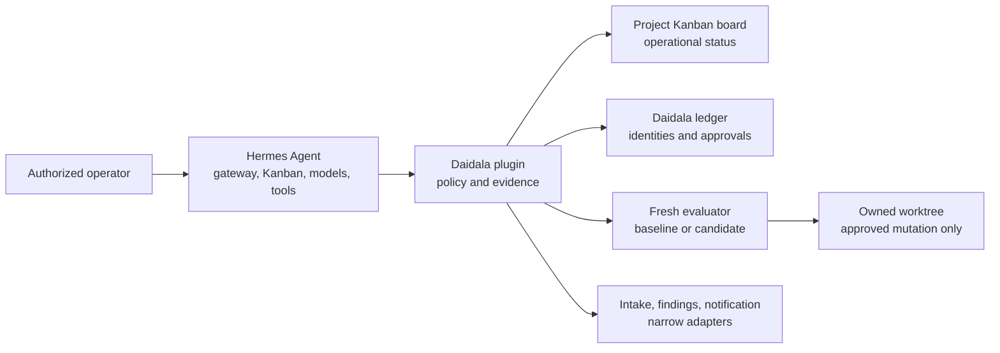
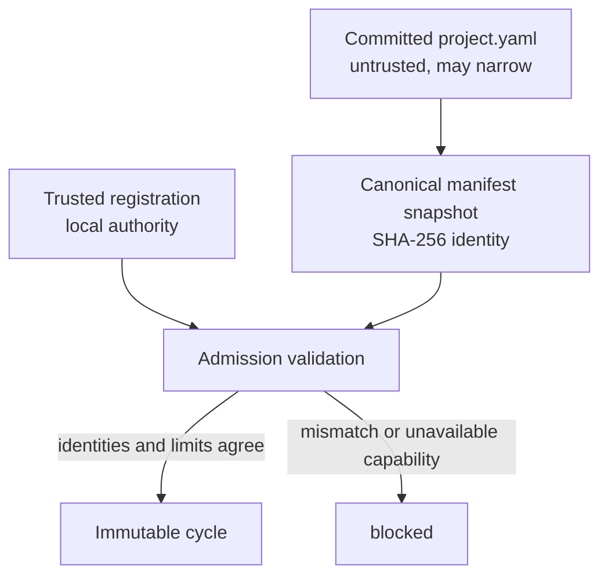
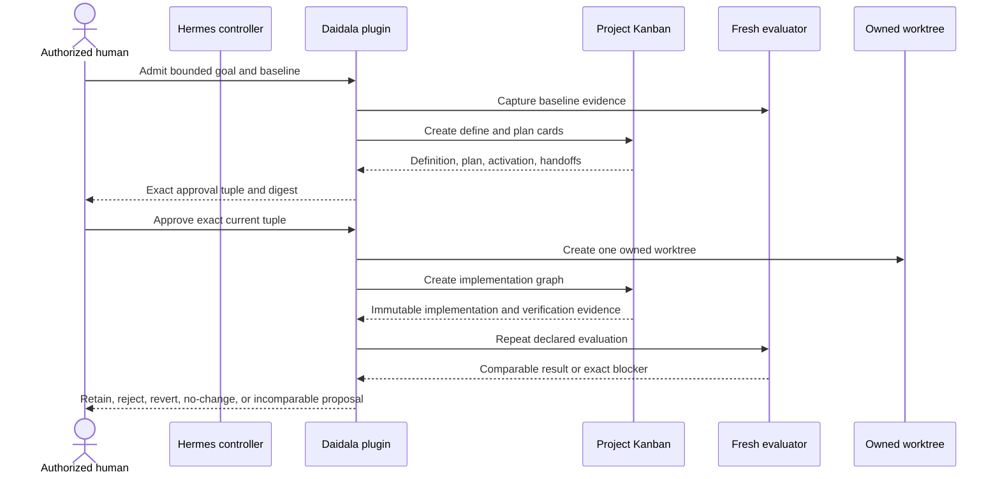
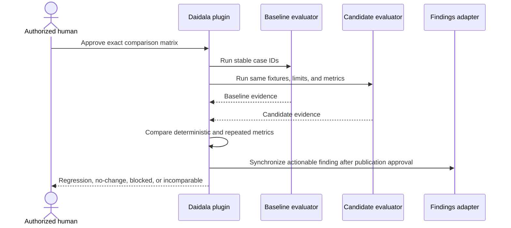
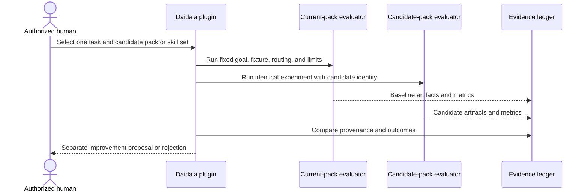
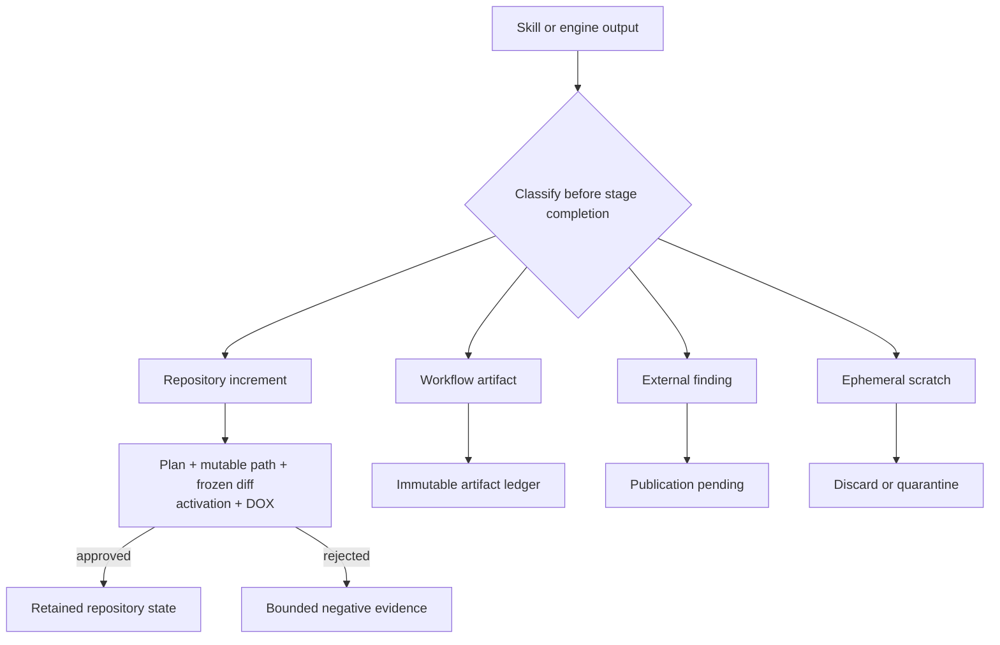
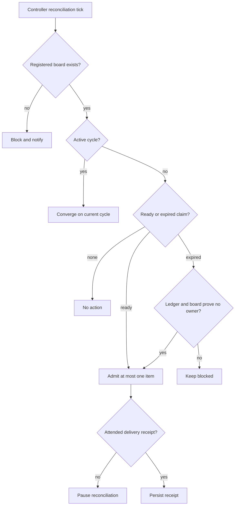
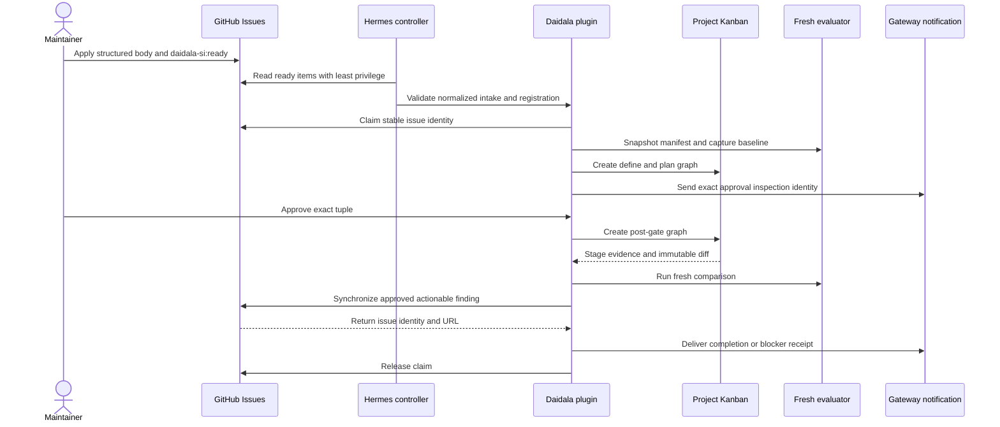

# Autonomous self-improvement flow

## Support status

The strict project manifest, trusted-registration model, cycle identity, metric
schema, delegation and lesson evidence, increment-document manifest, normalized
adapter records, Daidala project fixture, and stable evaluation case IDs are
implemented. Controller admission, live adapters, evaluators, reconciliation,
cron, GitHub setup, model execution, retention, and publication are planned and
unexercised. Commands marked **UNEXERCISED** are design examples, not supported
operator procedures.

Authoritative implementation sources are `daidala/projects.py`,
`daidala/registrations.py`, `daidala/cycles.py`, `daidala/increments.py`, and
`daidala/adapters.py`. The reusable and Daidala-instance plans remain the
implementation authority for unfinished phases:

- [Reusable protocol plan](plans/2026-07-13-self-improvement-loop.md)
- [Daidala dogfood plan](plans/2026-07-13-daidala-self-improvement-loop.md)
- [Versioned Phase 1 result](evaluation-results/v1/daidala-self-improvement.md)

## Purpose and invariant

A registered project may run a bounded baseline, execute one approved workflow,
collect deterministic and advisory evidence, propose one change, repeat the
same evaluation in a fresh environment, and retain the change only when all
required contracts still pass. A complete `no-change`, `blocked`, `rejected`, or
`incomparable` result is valid; the protocol never invents an improvement.

Daidala is an in-process Hermes plugin. Hermes remains the runtime, model router,
Kanban dispatcher, delegation host, scheduler, gateway, and tool boundary.
Daidala adds deterministic admission, policy, exact approval, artifact identity,
worktree ownership, comparison eligibility, and evidence integrity. No second
agent runtime, daemon, scheduler, dashboard server, or nested `hermes chat`
process is introduced.



## Glossary and authority map

| Term | Meaning | Authority |
|---|---|---|
| Project | One admitted repository with stable `project_id`. | Committed `.daidala/project.yaml`, narrowed by trusted registration. |
| Registration | Profile-local mapping from project identity to checkout, remote, profile, board, credentials, notification, evaluator, and limits. | Trusted local controller data. |
| Cycle | One immutable mode and intake/baseline/pack/candidate identity tuple. | Daidala ledger. |
| Workflow | The selected pack's `define -> plan -> approval -> implement -> verify -> review -> deliver` graph. | Daidala policy facts plus Hermes Kanban operations. |
| Controller | Persistent last-known-good Hermes profile coordinating one project. | Hermes runtime and trusted registration. |
| Board | Dedicated Hermes Kanban projection for cards, claims, dependencies, retries, comments, and workers. | Hermes Kanban; never mirrored by Daidala. |
| Evaluator | Fresh home and process loading one baseline or candidate artifact. | Approved local evaluator backend. |
| Pack | Independently versioned methodology-to-stage mapping. | Bundled pack resource and exact source/content identity. |
| Constraints | Workflow-scoped deterministic policy invariants. | Materialized constraint artifact and digest. |
| Adapter | Normalized intake, findings, or notification boundary. | Daidala record schema plus separately configured implementation. |
| Evidence | Reproducibility data and content-addressed outputs. | Daidala artifact ledger. |
| Finding | Actionable result synchronized by stable identity. | Local evidence first; external system only after a returned receipt. |
| Approval | Authorization of one exact current tuple. | Authorized maintainer from trusted registration. |

Related current contracts are [architecture](01-architecture.md),
[policy ledger](02-workflow-state.md), [pack reference](03-pack-reference.md),
[lifecycle stages](05-lifecycle-stages.md), [security](06-security.md),
[Hermes integration](08-hermes-integration.md), and
[workflow constraints](14-workflow-constraints.md).

## Knowledge and decision authority

| Knowledge | Canonical source | Use |
|---|---|---|
| Binding repository instructions | Applicable `AGENTS.md` chain in the assigned checkout | Deterministic pre-work contract. |
| Current architecture and rationale | Version-controlled architecture and decision documents | Reviewed repository increment. |
| Cycle policy, identities, approvals, digests, evidence | Daidala ledger and artifact store | Deterministic lookup and recovery. |
| Card status, retries, comments, worker runs | Project Hermes board | Operational lookup only. |
| Transcript and model observations | Hermes session facilities and bounded artifacts | Advisory until approved as an increment. |
| Temporal explanation | Git history | Explains current state; never revives stale instructions. |

No semantic-memory service is required in v1. Hindsight, Graphiti, or another
index may later be evaluated only as a rebuildable read-only projection keyed by
stable `project_id`. Recall can improve discovery but cannot govern admission,
approval, policy, comparison, recovery, or retention.

Every controller, worker, and evaluator reads DOX and architecture from its own
assigned checkout. Reading candidate policy from the persistent controller
checkout is a blocking identity error.

## Project manifest and trusted registration

The repository manifest is strict, bounded YAML. Duplicate keys, aliases,
anchors, custom tags, control characters, oversized content, unknown fields,
invalid globs, unbounded commands, and identity drift fail closed. Its canonical
JSON and SHA-256 digest bind the cycle.

The Daidala instance uses [`.daidala/project.yaml`](../.daidala/project.yaml),
which pins `forgegod/daidala`, the exact observed SSH remote, both bundled pack
source revisions and pack-resource digests, verification suites, mutable and
protected paths, intake categories, and disabled release actions.

Repository data cannot grant local authority. The trusted registration stores:

- absolute checkout;
- controller profile and project board;
- verified canonical remote;
- separate credential aliases for issue intake and findings;
- authorized local maintainer identities;
- attended Hermes gateway target alias;
- `restricted-container` evaluator with `denied-by-default` network; and
- finite cycle, turn, delegation, research, source, and wall-clock limits.

The registration path is derived from the Hermes-resolved profile data root as
`projects/<project_id>/registration.yaml`. It is never committed. Phase 1
validates structure and manifest binding only; filesystem, board, credential,
gateway, and backend capability probes remain Phase 2.

The Daidala instance reserves attended notification alias `attended-daidala`;
its gateway destination and authorized local identities remain profile-local.



## Cycle identity and exact approval

A cycle ID is the SHA-256 identity of:

```text
(project_id, mode, intake_adapter, intake_item_id, manifest_digest,
 baseline_revision, pack_name, pack_source_revision, pack_content_digest,
 candidate_identity)
```

`improve` has no candidate before approval. `regress` and `evaluate-pack`
require one exact candidate identity. Changing any input creates a different
cycle rather than mutating the existing one.

Implementation authority is narrower. The approval tuple is:

```text
(cycle_id, workflow_id, mode, manifest_digest, baseline_revision,
 pack_identity, constraints_revision, constraints_digest,
 plan_revision, plan_digest, candidate_identity)
```

Changing the manifest, baseline, pack, semantic constraints, plan, or candidate
invalidates approval. Formatting-only constraint replacement keeps the same
canonical digest and is a no-op. Generic Kanban unblock never represents this
approval. Admission, implementation, retention, commit, push, merge, release,
publication, deployment, and controller promotion are independent decisions.

Concrete invalidation examples:

| Change | Result |
|---|---|
| Replace plan content | New plan revision/digest; fresh implementation approval required. |
| Replace constraints semantically | New policy/constraint identity; stale cards and activation manifests become historical. |
| Reformat equivalent constraints | Same digest; no new identity. |
| Edit `.daidala/project.yaml` | Current cycle remains bound to its snapshot; new manifest governs only a later cycle. |
| Change Addyosmani to AI-DLC | New pack identity and cycle/approval. |
| Change baseline commit | New cycle. |
| Change candidate Daidala or Hermes artifact | New comparison cycle and approval. |

## Modes

### Improve



### Regress



`regress` never retains target changes and never loads candidate code into the
persistent controller.

### Evaluate pack



A successful comparison does not update the project manifest, controller skill
store, or default pack. Promotion is a later `improve` cycle.

## Transition contract

| Transition | Owner | Preconditions | Durable write | Idempotency | Notification | Stop result |
|---|---|---|---|---|---|---|
| Intake -> admitted | Daidala | Valid manifest, registration, ready item, no active cycle | Cycle identity and claim | Cycle tuple | Admission receipt | `blocked` on mismatch. |
| Admitted -> baseline | Evaluator | Fresh approved boundary | Commands, outputs, digests, identities | Atomic test-case ID | Failure/blocked receipt | `blocked` if incomplete. |
| Baseline -> define | Daidala/Hermes | Durable baseline | Definition card and evidence | Workflow/stage identity | Status receipt | `blocked` on skill or handoff failure. |
| Define -> plan | Hermes worker | Finalized activation and definition | Plan artifact and handoff | Plan revision | Approval-wait receipt | `blocked` on invalid plan. |
| Plan -> approval wait | Daidala | Exact current identities | Blocked approval card | Approval tuple | Exact inspection identity | Wait without mutation. |
| Approval -> implement | Authorized human/Daidala | Exact matching approval | Approval record, owned worktree, post-gate cards | Approval tuple | Approval receipt | `blocked` on stale tuple. |
| Implement -> verify | Hermes worker/Daidala | Owned worktree and finalized activation | Frozen changed paths, diff, increment entries | Stage/card identity | Failure receipt | `blocked` on scope drift. |
| Verify -> review | Verifier | Declared suites complete | Immutable verification evidence | Test-case/run identity | Recovery receipt | `blocked` or `incomparable`. |
| Review -> decision | Reviewer/Daidala | Frozen scope and complete evidence | Review and comparison | Evidence digests | Decision request | `rejected` or `incomparable`. |
| Decision -> retention | Authorized human | All required metrics pass, no protected regression | Retention decision | Exact comparison identity | Completion receipt | `retained`, `reverted`, or `no-change`. |
| Finding -> external | Findings adapter | Separate publication approval | Returned remote ID and URL | Stable finding ID | Publication receipt | Pending on outage. |
| Active -> archived | Authorized operator | No uncertain ownership | Archive fact, preserved evidence | Project/cycle identity | Archive receipt | `blocked` if active ownership exists. |

## Evidence and comparison

Every run records non-secret project, cycle, workflow, case, manifest, pack,
constraints, repository, Daidala, Hermes, model-route, evaluator, workspace,
worktree, command, exit-code, artifact, adapter, and metric identities. Raw logs
are bounded and content-addressed. Credentials, connection strings, profile
dumps, private board data, and unbounded logs are prohibited.

Metric authority is explicit:

- `deterministic`: required exact pass/fail; no retention threshold can weaken it;
- `repeated`: 2-20 declared repetitions with `all-pass`, `mean`, or `median`
  aggregation and an explicit maximum failure count; and
- `observational`: structured review evidence that cannot alone authorize
  retention.

Baseline and candidate use the same fixture, commands, environment class,
limits, and metric definitions unless the approved experiment tests that exact
difference. Missing data, excessive variance, stale structural graph data, or
identity mismatch yields `incomparable`.

Delegation evidence records parent and child run IDs, goal, role, toolsets, model
route, input/output artifact digests, turns, wall time, terminal state, and
bounded failure reason. Lesson-reuse evidence records the approved lesson
digest, applicability, failed actions avoided, recovery outcome, turns, wall
time, irrelevant matches, and unsafe use. A later controlled comparison is
required before calling retained knowledge an improvement.

The first lesson-reuse fixture is UC-01's calculator repair. The comparison runs
the same failing fixture once without and once with one approved, digest-pinned
lesson and records failed actions avoided, recovery, turns, wall time,
irrelevant matches, and unsafe uses. Structural graph evidence is comparable
only when the graph reports more than zero files and nodes and is built from the
exact evaluated repository revision. Missing revision identity, a stale index,
zero parsed files, or a graph-tool failure makes only that metric
`incomparable`; it cannot satisfy a deterministic gate.

## Increment document protocol

A produced file is not automatically evidence or project knowledge.

| Class | Location | Eligibility |
|---|---|---|
| Repository increment | Approved owned worktree | May become current documentation only through accepted diff, DOX reconciliation, and retention approval. |
| Workflow artifact | Profile-local immutable artifact store | Supports approval, comparison, review, or recovery; not committed documentation. |
| External finding | Local artifact first, then separately approved adapter | Requires source digest and returned remote identity. |
| Ephemeral work product | Evaluator/worktree scratch | Cannot enter the increment manifest; discard or quarantine. |

Each durable entry includes class, media type, purpose, content digest, byte
size, cycle/workflow/stage/policy/plan identities, project-manifest, pack,
constraints, activation identities, exact producer name and skill-directory
digest, timestamp, supersession, redaction, disposition, and repository DOX
scope when applicable. `producer: deterministic-engine` carries no skill digest;
all other producers require one.

Phase 1 enforces 1 MiB per document, 256 entries per manifest, canonical entry-ID
ordering, normalized relative paths, recognized media types, and fail-closed
classification. Ephemeral entries, unknown producer digests, duplicate IDs,
absolute or escaping paths, and invalid class/disposition combinations fail.
Phase 3 will reconcile entries against the approved plan, mutable-path policy,
frozen diff, artifact ledger, and finalized activation manifest.

The immutable manifest path is
`projects/<project_id>/cycles/<cycle_id>/increment-manifest.json` below the
Hermes-resolved profile data root. Evaluator scratch is contained under
`projects/<project_id>/cycles/<cycle_id>/evaluators/<evaluator-id>/scratch`.
Clean scratch is discarded after terminal retention state; dirty, crashed, or
ownership-ambiguous scratch moves only to the sibling `quarantine` directory and
requires explicit recovery before deletion.



## Adapter contracts

The engine consumes normalized records, not GitHub labels or prose directly.

- Intake records contain adapter/item identity, optional canonical HTTPS URL,
  category, priority, goal, acceptance criteria, evidence digests, dependencies,
  risk, admission actor, readiness, and optional bounded lease.
- Finding records use stable identity derived from project, category, title, and
  evidence digest. `published` requires both a returned remote identity and URL.
- Notification receipts contain adapter, attended target alias, returned receipt
  ID, and timezone-aware delivery time.

Phase 1 defines records and injectable protocols only. Phase 2 owns concrete
GitHub body/label validation, claims, retries, pending synchronization, receipt
validation, and admission coordination. The loop never marks its generated
finding `daidala-si:ready`.

## Recovery and reconciliation

| Condition | Required decision |
|---|---|
| Duplicate admission or cron tick | Resolve the deterministic cycle/workflow; create nothing twice. |
| Claim created, workflow missing | Retry creation with the same identity. |
| Expired claim | Return to ready only when ledger and board both prove no active owner. |
| Missing or manually changed board | Block; never recreate association from title or prose. |
| Evaluator crash before mutation | Preserve durable baseline and record incomplete result. |
| Evaluator crash after mutation | Quarantine owned worktree; never accept dirty files as evidence. |
| Stale manifest, card, plan, constraints, pack, or candidate | Reject evidence. |
| GitHub outage | Keep local finding `pending`; do not fabricate remote state. |
| Notification failure | Stop unattended progress until attended delivery succeeds. |
| Budget exhausted | Record `budget_exhausted`; dispatch no more work. |
| Unknown worktree ownership | Block destructive cleanup. |



## Security boundaries

- Repository code and manifests are untrusted and may only narrow local authority.
- Profiles and boards isolate configuration or operational state; they are not
  filesystem, process, credential, or network sandboxes.
- Candidate code cannot alter controller installation, trusted registration,
  approval policy, evaluator/judge code, immutable baseline, another project,
  or active manifest snapshot.
- Evaluators receive only approved minimum capabilities and never issue,
  publication, release, or controller credentials.
- One v1 cycle mutates at most one repository. Pack and target changes use linked
  cycles with independent approvals and evidence.
- Paths include project/cycle identity and are containment-checked before create
  or delete.
- Browser probes use a dedicated debug profile, never the user's normal profile.
- Secret-like evidence is rejected or redacted before persistence.

## Daidala dogfood instance

The first project is `forgegod-daidala`. Planned persistent identities are:

- profile `daidala-self-improvement`;
- board `daidala-forgegod-daidala`;
- committed manifest `.daidala/project.yaml`;
- constraints `.daidala/constraints.yaml`;
- registration under the profile-local project path;
- fresh evaluator home/process per baseline or candidate;
- one owned worktree per exactly approved implementation;
- versioned result record under `docs/evaluation-results/v1/`; and
- a paused reconciliation cron only after the first manual cycle passes.

The attended gateway alias is `attended-daidala`; its target and approval
identities remain trusted local data and are deliberately absent from the
repository.

### GitHub issue and claim sequence



GitHub Project membership is presentation only. Eligibility requires base label
`daidala-si`, exactly one namespaced category, repository priority, structured
body, and separate maintainer-applied `daidala-si:ready`. The issue template is
committed; labels, Project, credentials, and live issue mutation are uncreated
Phase 2 work.

### Pack-neutral activation

Both Addyosmani and AI-DLC map into the same lifecycle. The engine selects a
pack, validates its exact source/content identity, loads the full declared
candidate set for each card, and requires a finalized activation manifest before
methodology or evidence. Addyosmani references pinned external skills; AI-DLC
uses bundled `daidala:aidlc-adapter`. The engine contains no pack-name branch.

### UC-01 walkthrough

1. Admit the temporary `answer() == 2` fixture as `improve`.
2. Capture baseline failure before mutation.
3. Run define and plan separately with Addyosmani and AI-DLC.
4. Stop at the exact approval card; prove no implementation card exists.
5. After cycle-specific approval, create one owned worktree.
6. Preserve the failing attempt, apply the bounded fix and one justified adjacent
   regression, verify, review, and compare in a fresh evaluator.
7. Confirm the source checkout is unchanged and decide retain/reject from evidence.

Cases: `TC-F04-01`, `TC-F05-01`, `TC-F06-01`, `TC-F08-01`, `TC-F08-02`, and
`TC-F09-01`. Status: unexercised.

### UC-02 walkthrough

1. Admit checked division as an `improve` fixture.
2. Produce the first plan, then replace constraints semantically.
3. Reject the stale plan and cards; regenerate under the new digest.
4. Treat a formatting-only replacement as a no-op.
5. Implement code, public documentation, normal tests, and zero-division tests in
   the owned worktree.
6. Load the candidate Daidala artifact only in a fresh evaluator and run stable
   cases against the last-known-good Hermes/Daidala baseline.
7. Compare CLI, dashboard, and dedicated-debug-browser observations without
   changing the active controller.

Cases: `TC-F07-01`, `TC-F10-01`, `TC-F11-01`, `TC-F14-01`, and `TC-F15-01`.
Status: unexercised.

### UC-03 walkthrough

1. Human selects one externally grounded task and at most one candidate skill set.
2. Pin exact source revision and content digest.
3. Run current and candidate packs against the same goal, fixture, model routing,
   and limits in fresh evaluators.
4. Compare provenance, required metrics, observational evidence, and resource
   proxies.
5. Preserve a negative result or create a separate improvement proposal; never
   update defaults automatically.

Cases: `TC-F02-01`, `TC-F02-02`, `TC-F12-01`, `TC-F17-01`, and
`TC-F18-01` through `TC-F18-03`. Status: unexercised.

### Candidate promotion and rollback boundary

The controller remains on the last-known-good Hermes and Daidala pair. A
candidate host or plugin is installed only into a fresh isolated environment,
where repository tests, plugin discovery, pack validation, lifecycle acceptance,
model routes, dashboard compatibility, packaging, and install probes run. A
support-range change and controller promotion require separate approved work.
Failure preserves the baseline and creates at most one deduplicated finding.
Rollback means discarding the candidate evaluator or reverting an unretained
owned worktree; candidate code never replaces the currently loaded plugin.

## Planned operator procedures

The following commands are **UNEXERCISED** and intentionally not copied into the
getting-started path:

```bash
# UNEXERCISED: preview project registration without mutation
daidala projects register --manifest .daidala/project.yaml --dry-run

# UNEXERCISED: inspect an admitted cycle and exact approval tuple
daidala projects status forgegod-daidala --cycle <cycle-id>

# UNEXERCISED: approve only the displayed current digest
daidala projects approve forgegod-daidala --cycle <cycle-id> --digest <digest>

# UNEXERCISED: archive admission while preserving evidence
daidala projects archive forgegod-daidala --dry-run
```

Phase 2 must exercise setup preview, manual first run, status, approval, and
recovery before these can become supported commands. Phase 3 must exercise
pause/resume and reconciliation. Phase 4 must exercise candidate upgrades.
Teardown remains destructive and separately approved.

## Verification and source audit

Phase 1 verification is repository-local: focused schema tests, Ruff, Markdown
links, pack validation, and DOX reconciliation. It creates no profile, board,
GitHub object, model call, evaluator, cron, browser, or live finding. The stable
case matrix distinguishes pure-model passes from unrun integration behavior.
Later phases must replace `not-run` with exact evidence or `blocked`; they may not
infer success from this document.
