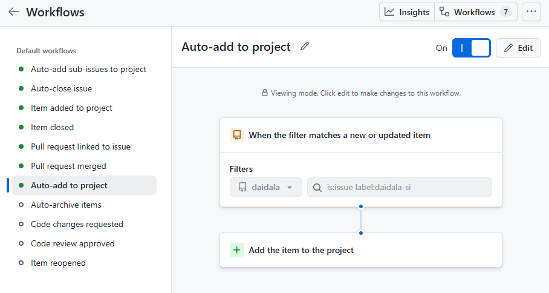

# Self-improvement environment prerequisites

## Purpose

This checklist prepares the one supported Daidala self-improvement dogfood
environment before a live cycle is admitted. Complete every required row and
retain the command output as redacted setup evidence. A repository test cannot
replace a failed host probe.

This document does not authorize a cycle, implementation, retention, commit,
push, publication, release, or runtime promotion. Those remain separate gates
in the [self-improvement flow](15-self-improvement.md).

This guide is the normative source of truth for the Daidala dogfood
prerequisites and their remediation. The implemented read-only CLI checker
mirrors the stable check IDs in the ready-to-admit table and reports omissions;
it cannot add, weaken, waive, or silently repair a prerequisite. A passing
report is evidence for human review, not setup approval or cycle approval.

Authoritative external references:

- [Hermes profiles](https://hermes-agent.nousresearch.com/docs/user-guide/profiles)
- [Hermes plugins](https://hermes-agent.nousresearch.com/docs/user-guide/features/plugins)
- [Hermes Kanban](https://hermes-agent.nousresearch.com/docs/user-guide/features/kanban)
- [Hermes messaging gateway](https://hermes-agent.nousresearch.com/docs/user-guide/messaging/)
- [GitHub CLI authentication refresh](https://cli.github.com/manual/gh_auth_refresh)
- [GitHub personal access tokens](https://docs.github.com/en/authentication/keeping-your-account-and-data-secure/managing-your-personal-access-tokens)
- [Fine-grained token permissions](https://docs.github.com/en/rest/authentication/permissions-required-for-fine-grained-personal-access-tokens)
- [Docker Desktop WSL integration](https://docs.docker.com/desktop/features/wsl/)

## Fixed instance identity

| Concern | Required value |
|---|---|
| Repository | `forgegod/daidala` |
| Checkout | `/home/raphael/src/rb/daidala` |
| Git remote | `git@github.com:forgegod/daidala.git` |
| Project ID | `forgegod-daidala` |
| Controller profile | `daidala-self-improvement` |
| Kanban board | `daidala-forgegod-daidala` |
| Notification alias | `attended-daidala` |
| Evaluator | `restricted-container` |
| Evaluator network | `denied-by-default` |
| Supported Hermes baseline | `v0.18.2` |
| Approved and installed controller revision | `3ce1bfc15c5102d75d54e846ea6ddb8520b6eed8` |

The controller may carry model, issue, and notification credentials. A fresh
evaluator must not clone the controller profile or receive issue mutation,
notification, publication, release, or controller credentials.

## Current prerequisite state

This table is the current setup inventory. Only a clean, non-mutating
`daidala doctor --live` report can promote a prerequisite from inventory to
retained evidence.

| Prerequisite | State | Evidence |
|---|---|---|
| Hermes baseline | Pass | `Hermes Agent v0.18.2 (2026.7.7.2)` |
| Repository identity | Pass | The live report verifies canonical repository `forgegod/daidala`, a clean branch checkout after cancellation, trusted remote identity, and frozen Phase 5D evaluation baseline `3ce1bfc`; no active cycle exists. |
| Daidala command surfaces | Pass | Standalone and native controller-profile commands report Daidala `0.2.0`; native pack validation succeeds. |
| Controller plugin revision | Pass | The controller profile loads clean detached revision `3ce1bfc15c5102d75d54e846ea6ddb8520b6eed8`; native and standalone live diagnosis verify the same identity. Rollback `2595bf5` remains outside discovery. |
| Controller profile | Pass | `/home/raphael/.hermes/profiles/daidala-self-improvement` exists and the sticky profile remains `hermes-vc`. |
| Reconciliation cron | Pass | Exactly one profile-local no-agent job uses the digest-matched wrapper, `every 15m` with infinite repeat, and the registered checkout; it is paused after two successful controlled executions that converged on one cycle. |
| Dedicated board | Pass | Installation-global board `daidala-forgegod-daidala` exists with the exact checkout as default workdir; both controlled UC-01 workflows are terminal and it did not replace the current `default` board. |
| Restricted container | Pass | Docker integration is available again; native and standalone live diagnosis reproduce the retained restricted-container boundary with the digest-pinned image and denied network. |
| GitHub runtime credentials | Pass | Non-secret alias bindings exist. Both bounded runtime read probes pass, and retained evidence includes their request identities, expirations, and the separately approved controlled findings-write receipt. |
| GitHub operator credential | Pass | `gh-vault run --name ghcli -- gh project list` succeeds, and `GH_TOKEN_DAIDALA_PROJECT_MGMT` is absent from the controller profile. Attended Project authority remains isolated in `gh-vault`. |
| GitHub Project | Pass | Private user-owned Project 1 is linked to `forgegod/daidala`, contains the eight exact Daidala fields in addition to GitHub defaults, and has the optional issue/`daidala-si` auto-add workflow enabled through the GitHub UI. |
| Attended notification | Pass | Telegram home delivery returned receipt `telegram:10`; the operator confirmed the exact probe content and both live reports validate the retained identity. |
| Self-improvement labels | Pass | All 17 exact `daidala-si` base, state, category, and priority labels exist in `forgegod/daidala`. |
| Trusted runtime state | Pass | Strict registration v2, `credential-bindings.yaml`, and non-secret `prerequisite-evidence.json` parse and both live reports pass all eleven checks. The private attended destination remains profile-local. |

The current native and standalone reports pass all eleven checks with exact
controller `3ce1bfc15c5102d75d54e846ea6ddb8520b6eed8`, terminal issues
#5/#6/#7/#9/#11, unready issue #10, and a clean repository. Rollback controllers
`2595bf5f8aacdd1411c101250acc2d0211eaf22a`,
`9f380a6b04fdbb51817c7ac2279b217fda34f0c2`,
`9d9f4f6a2801293e20622d98c97f50d017888872`, and
`550671c19e5434fbe183140214ca12b4a047692d`, with their prior evidence, remain
outside plugin discovery.

Do not admit UC-01 unless every required row passes and the operator separately
approves that exact cycle.

## Reproduction sequence

This file is the complete setup and configuration guide. Reproduce the instance
in this order; a later step must not be used to waive an earlier blocker.

| Step | Result | Mutation | Current state |
|---|---|---|---|
| 1 | Verify host and repository identity. | None. | Pass; repeat from the final clean checkout. |
| 2 | Verify Docker availability, then produce evaluator isolation evidence. | The isolation probe creates a disposable container. | Pass; Docker integration is available and both live reports reproduce the retained evaluator boundary. |
| 3 | Provision one attended operator credential and two least-privilege runtime credentials. | Vault and profile environment only. | Operator token is isolated; both runtime read probes and the controlled findings write probe pass. |
| 4 | Create the controller profile without changing the sticky profile. | Hermes profile. | Pass. |
| 5 | Install the selected detached Daidala revision. | Controller plugin directory. | Pass at exact detached revision `3ce1bfc15c5102d75d54e846ea6ddb8520b6eed8`. |
| 6 | Create the dedicated Kanban board. | Installation-global Hermes board. | Pass. |
| 7 | Configure and verify the attended gateway target. | Profile gateway/home channel. | Pass; delivery receipt and operator confirmation are retained and live-validated. |
| 8 | Create labels and the user-owned GitHub Project. | GitHub Issues and Projects. | Required projection and optional attended UI auto-add pass. |
| 9 | Materialize trusted non-secret registration, bindings, and receipts. | Profile-local project files. | Pass; registration v2 binds the exact private attended destination, and bindings plus combined evidence validate strictly. |
| 10 | Run the read-only live prerequisite checker from a clean checkout. | None. | Native and standalone reports pass all eleven `SI-*` checks with installed controller `3ce1bfc15c5102d75d54e846ea6ddb8520b6eed8`. |
| 11 | Admit UC-01 manually. | GitHub issue, board, evaluator, and cycle artifacts. | Pass for controlled Addyosmani issue #2 and Aidlc issue #3; both are closed as completed and their claims are released. |
| 12 | Create the approved script-only reconciliation job, then run the separately approved duplicate-tick probe. | Profile-local wrapper, non-secret digest evidence, immutable tick results, and Hermes cron metadata. | Pass; outcomes are `admitted` then `replayed` for one cycle and receipt; exactly one no-agent job is paused on `every 15m` with infinite repeat. |
| 13 | Apply the separately approved terminal probe cancellation. | GitHub issue, workflow cards, attended notification, and mode-`0600` cancellation receipts. | Pass at preview `9deb8cef`; issue #4 is closed not planned, both cards are archived, replay converges, and native plus standalone diagnosis pass 11/11. |
| 14 | Run one separately selected Phase 5C improvement through measurement and retention. | Published issue, workflow artifacts, owned worktrees, and one approved target diff. | Pass; implementation `401f3dfe` is retained, completion `f9f5566e` closed issue #5 completed, both diagnosis routes pass 11/11, and the cron remains paused. |
| 15 | Verify and separately decide whether to retain both control-plane remediations. | Retained controller revision and rollback evidence; live workflow remains separately gated. | Pass for approval-boundary probe `tc-f06-direct-approval-probe-v2` at `9f380a6` and immutable-artifact probe `tc-f07-revision-artifact-probe-v1` at installed `2595bf5`; both reject the prohibited mutation, clean up exactly, and retain 11/11 diagnosis with paused cron. Issues #6/#7 are closed completed. |
| 16 | Freeze the UC-03 packet and prepare paired intake. | Approved controller swap and two unready GitHub issues only. | Packet v1 `c0cdfefb` is retained; detached controller `3ce1bfc` is installed with rollback `2595bf5`; first control issue #9 is canceled not planned, candidate issue #10 remains unready, and both diagnosis routes pass 11/11 with paused cron and no active cycle or owned worktree. |
| 17 | Repair UC-03 packet visibility before replacement admission. | Repository packet v2 plus separately approved profile-local copy and intake mutation. | First cancellation `e606f24c` retained exact command drift and `telegram:57`; packet v2 `eb02da7c` made exact bytes available, then replacement issue #11 canceled at `fc865175`/`telegram:59` when planning proved baseline `3ce1bfc` lacked the fixture. |
| 18 | Establish the fixture-bearing UC-03 baseline. | Ten-file repository checkpoint: eight frozen fixture paths, pytest collection exclusion, and owning DOX update. | Clean baseline `c53ba52` passes the exact frozen behavior, full pytest, Ruff, and Markdown links; packet v3 `7139cf3e` binds it with unchanged fixture identity. Profile distribution and replacement intake mutation remain unapproved. |

The operator owns browser authorization, credential creation, attended-channel
confirmation, setup approval, and later cycle approval. The agent may select a
verified revision and perform approved mechanical setup, but it must not infer
credentials, invent receipts, or silently start UC-01.

### Inspect revision-addressed workflow artifacts

A controller revision that supports immutable stage evidence stores it under:

```text
<profile-data-root>/daidala/workflows/<workflow-id>/artifacts/
  policy-<zero-padded-revision>/
    define.md
    plan-<zero-padded-revision>/
      plan.md
      implementation.diff
      implementation-paths.json
      verification-<sha256>.txt
      review.md
      delivery.json
```

Use the ledger's exact artifact path and digest when inspecting evidence. An
identical retry converges on the existing bytes. A retry with different bytes
at the same revision path is a conflict: stop and inspect the ledger and file;
do not overwrite, delete, rename, copy forward, or create a `current`/`latest`
alias. Missing historical artifacts are blockers and are never reconstructed
from another revision.

## 1. Run the non-mutating preflight

These commands were exercised against Hermes v0.18.2 and the current checkout:

```bash
hermes --version
hermes profile list
hermes profile show daidala-self-improvement
hermes kanban boards list
hermes -p daidala-self-improvement gateway status
hermes -p daidala-self-improvement plugins list --plain --no-bundled

docker version --format '{{.Client.Version}}|{{.Server.Version}}'

gh-vault list
gh-vault run --name ghcli -- gh api user --jq .login
gh-vault run --name ghcli -- gh repo view forgegod/daidala \
  --json nameWithOwner,url,viewerPermission,hasIssuesEnabled
gh-vault run --name ghcli -- \
  gh project list --owner @me --limit 100 --format json
```

Expected failures are actionable blockers, not values to copy into the trusted
registration. Never copy token strings, connection strings, or credential file
contents into setup evidence.

## 2. Enable the restricted container boundary

On Windows, open Docker Desktop:

1. Open **Settings**.
2. Open **Resources > WSL Integration**.
3. Enable integration for the WSL distro running this checkout.
4. Apply and restart Docker Desktop.

Verify from this WSL shell:

```bash
docker version --format '{{.Client.Version}}|{{.Server.Version}}'
docker network inspect none --format '{{.Name}}|{{.Driver}}'
```

Use an existing exact image identity. Do not pull an arbitrary image merely to
make this prerequisite pass. The first command is non-mutating; `--apply` creates
one disposable container and emits only non-secret evidence:

```bash
EVALUATOR_IMAGE='catthehacker/ubuntu@sha256:3220992391c1182a0cfe4c64453511772c54f4c39e960d26a5e327960675982e'

daidala evaluator probe --image "$EVALUATOR_IMAGE"
daidala evaluator probe --image "$EVALUATOR_IMAGE" --apply
```

The implementation refuses tags and bare digests. It inspects the exact local
repository digest and rejects images declaring volumes, then runs as the
non-root host UID/GID with `--network none`, a read-only root, all capabilities
dropped, no-new-privileges, one candidate-workspace bind mount, fresh bounded
tmpfs home and `/tmp`, a 64 KiB output bound, and no inherited controller
credentials. The runtime probe requires only loopback networking and rejects
credential-like environment keys. If Docker cannot run from WSL, stop; do not
replace `restricted-container` with the local backend.

## 3. Configure GitHub operator and runtime credentials

This setup uses three distinct credentials: one attended operator Project
credential, one read-only intake credential, and one issue-write findings
credential. The operator credential is stored in `gh-vault` profile `ghcli`.
The two runtime values are configured in the controller profile environment;
their non-secret Daidala bindings exist, while capability evidence remains
blocked until both values pass the probes in Sections 3.2 and 3.3.

The trusted registration names runtime aliases only. It never contains token
values, and the implementation must verify alias capability without exposing a
credential.

These capabilities are properties of runtime credentials, not settings on the
GitHub Project. The Project contains fields and items; it does not hold API
permissions or Daidala aliases.

Required runtime credential capabilities:

| Alias | Allowed | Denied |
|---|---|---|
| `github-daidala-read-issues` | Read repository metadata, labels, issues, comments, and Project fields. | Create/edit issues, repository contents, administration, merge, release, deployment. |
| `github-daidala-write-issues` | Read metadata and create/update labeled findings. | Repository contents, administration, merge, release, deployment. |

For the current user-owned `forgegod` Project, GitHub documents an important
limitation: fine-grained personal access tokens cannot access Projects owned by
a user account. The minimal practical split is therefore:

- `github-daidala-read-issues`: a classic personal access token with only
  `read:project` and `read:org`; the latter is required for reliable `gh project`
  owner resolution even for this user-owned Project. Public issue, label,
  comment, and repository metadata remain readable without a repository-write
  scope;
- `github-daidala-write-issues`: a fine-grained personal access token whose
  resource owner is `forgegod`, repository selection is only `daidala`, and
  repository permissions are `Metadata: read` and `Issues: read and write`.

### 3.1 Configure the operator Project credential
The operator credential creates and configures the Project. It is not used by
the unattended controller and is not one of the two runtime aliases.

For a fresh machine, authorize a token with `read:project`, `project`,
`read:org`, and `read:discussion`, then store it without placing the value on a
command line:

```bash
read -rsp 'Operator GitHub token: ' token; printf '\n'
printf '%s' "$token" | gh-vault set ghcli --stdin \
  --note 'Attended Daidala Project setup only'
unset token
```

If `gh` already owns the token, `gh auth refresh --hostname github.com
--scopes read:project,project,read:org,read:discussion` is the supported
interactive alternative, followed by
`gh auth token | gh-vault set ghcli --stdin`. Do not copy the resulting token
into the controller profile. Let `gh-vault set` inspect the token; a manual
scope declaration is metadata, not capability proof.

Verify through the bounded child-command surface:

```bash
gh-vault run --name ghcli -- gh api user --jq .login
gh-vault run --name ghcli -- \
  gh project list --owner @me --limit 100 --format json
```

The login must be `forgegod`. The Project command must return JSON without an
authorization error; an empty list means access works but setup has not created
the Project. `gh-vault run` injects the token only into the child process.

`GH_TOKEN_DAIDALA_PROJECT_MGMT` is not consumed by Daidala. If it exists in the
controller profile `.env`, remove that entire variable there after confirming
`gh-vault` access. Keep attended Project authority in `gh-vault`, outside the
unattended controller.

### 3.2 Create `github-daidala-read-issues`

GitHub currently documents that fine-grained personal access tokens cannot
access Projects owned by a user account. Use a narrowly scoped classic token for
this read-only alias:

1. Open [Developer settings > Personal access tokens > Tokens (classic)](https://github.com/settings/tokens).
2. Select **Generate new token > Generate new token (classic)**.
3. Name it `Daidala issue intake` and select a short expiration.
4. Select only **`read:project`** and **`read:org`**. `gh project` requires both
   scopes to resolve the Project owner without authorization errors.
5. Leave `repo`, `public_repo`, `project`, `workflow`, package, administration,
   and deletion scopes unselected.
6. Generate the token and save it immediately in your own password manager or
   organization vault. Use `github-daidala-read-issues` as the entry name.
7. Close the GitHub page after confirming that the password manager or vault
   contains the value. GitHub will not show the token again.

The alias is a Daidala name, not an object created in GitHub. Public repository
metadata, issues, labels, and comments remain readable without a repository
scope; `read:project` adds Project-field access and `read:org` allows reliable
owner resolution by `gh project`.

To probe the token without adding it to shell history, run this manually in an
attended shell:

```bash
read -rsp 'Read token: ' DAIDALA_READ_TOKEN; printf '\n'
GH_TOKEN="$DAIDALA_READ_TOKEN" gh project list \
  --owner forgegod --limit 100 --format json
GH_TOKEN="$DAIDALA_READ_TOKEN" gh issue list \
  --repo forgegod/daidala --limit 1
unset DAIDALA_READ_TOKEN
```

Both reads must succeed. Do not test denied mutation by attempting to alter a
real issue or Project.

### 3.3 Create `github-daidala-write-issues`

Use a fine-grained token restricted to one repository for finding publication:

1. Open [Developer settings > Personal access tokens > Fine-grained tokens](https://github.com/settings/personal-access-tokens).
2. Select **Generate new token**.
3. Name it `Daidala finding publisher`, add a short expiration, and select
   `forgegod` as the resource owner.
4. Under **Repository access**, select **Only select repositories**, then select
   only `daidala`.
5. Under **Repository permissions**, set **Issues** to **Read and write**.
6. Keep **Metadata** at its automatic **Read-only** value.
7. Leave Contents, Administration, Pull requests, Actions, Workflows,
   Deployments, Environments, Pages, Secrets, Variables, and other permissions
   at **No access**.
8. Generate the token and save it immediately in your own password manager or
   organization vault. Use `github-daidala-write-issues` as the entry name.

Verify its read half without exposing the token:

```bash
read -rsp 'Findings token: ' DAIDALA_FINDINGS_TOKEN; printf '\n'
GH_TOKEN="$DAIDALA_FINDINGS_TOKEN" gh issue list \
  --repo forgegod/daidala --limit 1
unset DAIDALA_FINDINGS_TOKEN
```

Do not verify write access by creating a disposable issue: GitHub issues cannot
be deleted through the normal workflow and the probe would leave live state.
The first write probe belongs to the separately approved controlled issue and
must retain its returned issue ID and URL as setup evidence.

Store only the two runtime values in the controller profile environment. If the
profile does not exist on a fresh machine, complete Section 4 first and return
here:

```bash
profile_env="$(hermes -p daidala-self-improvement config env-path)"
chmod 600 "$profile_env"
"${EDITOR:-nano}" "$profile_env"
```

Add these two assignments with their real values:

```dotenv
GH_TOKEN_DAIDALA_READ_ISSUES=<read-only-intake-token>
GH_TOKEN_DAIDALA_WRITE_ISSUES=<issue-write-findings-token>
```

Remove any `GH_TOKEN_DAIDALA_PROJECT_MGMT` assignment from this profile file;
that attended credential remains in `gh-vault`. Restart the profile gateway so
the service reloads the runtime environment, then verify names only:

```bash
hermes -p daidala-self-improvement gateway restart
grep -q '^GH_TOKEN_DAIDALA_READ_ISSUES=' "$profile_env"
grep -q '^GH_TOKEN_DAIDALA_WRITE_ISSUES=' "$profile_env"
! grep -q '^GH_TOKEN_DAIDALA_PROJECT_MGMT=' "$profile_env"
```

These checks print no values. Never run `cat`, `env`, `set`, or `printenv` against
the profile environment as setup evidence.

### 3.4 Understand how password-manager entries connect to aliases

An "external credential manager" means a user-owned password manager such as
Bitwarden or KeePass, an operating-system secret store, or an organization
vault. It is not a GitHub Project feature and Daidala does not currently connect
to any of these products.

The names in trusted registration are logical identifiers only:

```yaml
credentials:
  intake: github-daidala-read-issues
  findings: github-daidala-write-issues
```

Creating entries with matching names in Bitwarden or KeePass does not bind them
to Daidala. There is no name-based lookup, browser extension integration, or
implemented `bw`, `bws`, `keepassxc-cli`, or KeePass database adapter. The
implemented V1 bridge is explicit:

```text
registration alias
    -> profile-local credential binding
    -> named process environment variable
    -> GH_TOKEN for the bounded GitHub CLI subprocess
```

The profile-local binding will contain only the alias, resolver type
`environment`, and environment-variable name. It will never contain the token
value. Daidala will not auto-detect a password manager or invoke its CLI. The
operator may copy a token into the controller's protected environment or use a
user-owned launcher that retrieves it from Bitwarden/KeePass and injects it when
the controller starts. Product-specific launch commands remain undocumented
until exercised and verified.

This separation avoids coupling Daidala to a personal vault and keeps vault
unlocking, session lifetime, and master-password handling outside the agent and
GitHub adapters. The adapter receives only the resolved runtime credential,
passes it as `GH_TOKEN` to the required `gh` subprocess, and must never print,
persist, hash, or return it as evidence.

Store the non-secret bindings beside the trusted registration as
`credential-bindings.yaml`:

```yaml
schema: daidala.credential-bindings/v1
project_id: forgegod-daidala
bindings:
  - alias: github-daidala-read-issues
    resolver: environment
    environment_variable: GH_TOKEN_DAIDALA_READ_ISSUES
  - alias: github-daidala-write-issues
    resolver: environment
    environment_variable: GH_TOKEN_DAIDALA_WRITE_ISSUES
```

The two explicit variables must be distinct and must not be named `GH_TOKEN`.
The checker resolves one only at its bounded GitHub call, constructs a minimal
child environment, and maps that value to `GH_TOKEN`. Missing variables,
unsupported resolvers, duplicate aliases, reused variables, unknown fields, and
embedded credential values fail before a GitHub command runs.

### 3.5 Record aliases without recording secrets

Retain a redacted setup record containing only:

- alias name;
- token type (`classic` or `fine-grained`);
- resource owner and selected repository where applicable;
- granted permission names;
- expiration date; and
- successful read-probe timestamp.

Never record the token value, prefix, suffix, fingerprint derived from the
token, or credential-manager export. Do not add either token to GitHub Project
fields, repository variables, repository secrets, `registration.yaml`, command
arguments, committed files, or evaluation results.

Do not grant `repo`, `public_repo`, `Contents`, `Administration`, pull-request,
workflow, deployment, release, or package write permissions. Public repository
content remains publicly readable; the boundary denies authenticated content
mutation rather than pretending public data can be hidden.

The operator command above updates the interactive `gh` credential only. It
does not create either runtime alias.

Retain non-secret capability metadata and prior approved receipts in sibling
`prerequisite-evidence.json`. Its strict
`daidala.prerequisite-evidence/v1` object binds the project ID, approved
controller revision, unchanged sticky profile, exact allowed and denied
credential capabilities, GitHub Project identity and required fields,
notification alias and receipt, and evaluator isolation receipt. It contains no
token, token-derived value, private destination ID, or raw command output.

```json
{
  "schema": "daidala.prerequisite-evidence/v1",
  "project_id": "forgegod-daidala",
  "approved_controller_revision": "3ce1bfc15c5102d75d54e846ea6ddb8520b6eed8",
  "sticky_profile": "hermes-vc",
  "credential_capabilities": [
    {
      "alias": "github-daidala-read-issues",
      "capability": "github-intake",
      "allowed": ["read-organization", "read-project", "read-public-repository"],
      "denied": ["contents-write", "administration", "merge", "release", "deployment"],
      "expires_on": "<YYYY-MM-DD>",
      "read_probe_receipt": "<approved-receipt-id>",
      "write_probe_identity": null
    },
    {
      "alias": "github-daidala-write-issues",
      "capability": "github-findings",
      "allowed": ["metadata-read", "issues-read-write"],
      "denied": ["contents-write", "administration", "merge", "release", "deployment"],
      "expires_on": "<YYYY-MM-DD>",
      "read_probe_receipt": "<approved-receipt-id>",
      "write_probe_identity": "<approved-controlled-issue-id>"
    }
  ],
  "github_project": {
    "owner": "forgegod",
    "project_id": "PVT_kwHOAAjENs4Bd2Xo",
    "url": "https://github.com/users/forgegod/projects/1",
    "fields": [
      "category", "priority", "readiness", "claim-owner",
      "claim-lease-expiry", "cycle-id", "workflow-id",
      "terminal-comparison-outcome"
    ],
    "read_probe_receipt": "<approved-receipt-id>"
  },
  "notification": {
    "adapter": "hermes-gateway",
    "target_alias": "attended-daidala",
    "authorized_maintainer": "forgegod",
    "receipt_id": "<approved-receipt-id>"
  },
  "evaluator": {
    "backend": "restricted-container",
    "network": "denied-by-default",
    "image_identity": "<pinned-image-identity>",
    "fresh_home": true,
    "network_denied": true,
    "controller_credentials_absent": true,
    "bounded_mounts": true,
    "receipt_id": "<approved-receipt-id>"
  }
}
```

Use `null` for a Project, notification, or evaluator record that has not been
produced by its separately approved setup probe; the matching check remains
`blocked`. Do not invent receipt IDs to make diagnosis pass.

If the available credential cannot be represented with these boundaries, stop
and provision a narrower GitHub App or fine-grained token. A broad operator
token is not silently accepted as either runtime alias.

## 4. Create the controller profile without changing the default

This command intentionally clones controller model credentials and skills from
`hermes-vc`. It does not clone sessions or memory. Do not use this operation for
an evaluator.

```bash
hermes profile create daidala-self-improvement \
  --clone-from hermes-vc \
  --description 'Coordinates one approval-gated Daidala self-improvement cycle.'
hermes -p daidala-self-improvement config set terminal.cwd \
  /home/raphael/src/rb/daidala
```

Do not run `hermes profile use`; the sticky default must remain unchanged.
Verify:

```bash
hermes profile show daidala-self-improvement
hermes profile list
```

The controller model remains explicit in the profile. Changing it is a separate
configuration decision and changes comparison inputs.

## 5. Verify the Daidala plugin in the controller

`plugins enable` does not install or discover a checkout. Daidala does not need
to be published to PyPI: Hermes v0.18.2 supports Git repository installation and
directory plugins. The persistent controller must load one exact committed
last-known-good revision, never the mutable working checkout.

The approved and installed controller revision is
`3ce1bfc15c5102d75d54e846ea6ddb8520b6eed8`. Every reproduction or replacement
still requires separate approval for that exact identity. It is:

- reachable from the local repository and eligible for the GitHub path only
  after separate publication approval;
- contains the required evaluator and comparison implementation; and
- verified by the repository gate and detached-clone check.

The controller currently loads this exact detached revision, exposes
`project-cycle admit`, `project-cycle reconcile`, `project-cycle complete`, and
`project-cycle cancel`,
and passes native and standalone live diagnosis with registration v2.
Installation never authorizes a cycle.
For a fresh reproduction, choose exactly one installation path below. The local
detached-clone path is required until publication of the selected revision is
separately approved. Both paths must pass isolated Hermes v0.18.2 discovery and
pack validation before use.

The installed revision enforces the empirically required `read:org` intake
capability, and retained live evidence includes `read-organization`. Do not
write capability evidence that omits a granted scope.

### 5.1 Install an approved revision from GitHub

Use this path only while the selected commit remains reachable from the public remote.
PyPI publication is not required. `hermes plugins install forgegod/daidala`
tracks the repository branch and cannot pin a commit, so it is not accepted for
the persistent controller. Revision
`3ce1bfc15c5102d75d54e846ea6ddb8520b6eed8` is currently unpushed, so this path
is unavailable unless that exact commit receives separate publication approval.

```bash
(
set -euo pipefail
approved_revision="${APPROVED_PUBLISHED_REVISION:?set an approved published revision}"
remote=https://github.com/forgegod/daidala.git
profile_home="$(dirname "$(hermes -p daidala-self-improvement config path)")"
plugin_dir="$profile_home/plugins/daidala"

test ! -e "$plugin_dir" && test ! -L "$plugin_dir"

mkdir -p "$profile_home/plugins"
git clone --no-checkout "$remote" "$plugin_dir"
git -C "$plugin_dir" cat-file -e "$approved_revision^{commit}"
git -C "$plugin_dir" checkout --detach "$approved_revision"
hermes -p daidala-self-improvement plugins enable daidala
)
```

### 5.2 Install an approved but unpushed local commit

Use a detached clone when the approved commit exists locally but is intentionally
not pushed. Do not symlink the mutable checkout and do not install its editable
virtualenv into Hermes.

```bash
(
set -euo pipefail
profile_home="$(dirname "$(hermes -p daidala-self-improvement config path)")"
plugin_dir="$profile_home/plugins/daidala"
approved_revision=3ce1bfc15c5102d75d54e846ea6ddb8520b6eed8
test ! -e "$plugin_dir" && test ! -L "$plugin_dir"

git -C /home/raphael/src/rb/daidala cat-file -e \
  "$approved_revision^{commit}"

mkdir -p "$profile_home/plugins"
git clone --no-hardlinks --no-checkout \
  /home/raphael/src/rb/daidala "$plugin_dir"
git -C "$plugin_dir" checkout --detach "$approved_revision"
hermes -p daidala-self-improvement plugins enable daidala
)
```

If the target exists, stop and inspect it; never overwrite or update it
implicitly. If Hermes asks whether Daidala may replace built-in tools, answer
**No**. Daidala does not require `--allow-tool-override`.

To replace an existing approved detached revision, clone and verify the new
revision under `$profile_home/plugin-staging/`, and retain the previous checkout
under `$profile_home/plugin-rollbacks/`. Stop the profile gateway, move only the
verified checkout into `$profile_home/plugins/daidala`, and atomically update
`approved_controller_revision` in `prerequisite-evidence.json` plus
`controller_revision` in `reconciliation-cron.json` while preserving mode
`0600`. Back up both evidence files beside the retained checkout before the
swap. Then restart and run the complete gate. When one active cycle is expected,
invoke doctor inside an explicit conditional and accept exit code 2 only when
`SI-ACTIVE-CYCLE` is the sole non-pass check; an `ERR` trap must not treat that
expected result as an installation failure. On any actual failure, stop the
gateway, move the failed candidate back outside `plugins/`, restore the previous
checkout and both evidence files, restart, and verify the old revision again.

Never place staging, backup, failed, or rollback checkouts anywhere below
`$profile_home/plugins/`. Hermes discovers plugin manifests in sibling
directories there; two Daidala manifests share one plugin key, and the later
discovered checkout can silently override `$profile_home/plugins/daidala`.

### 5.3 Verify discovery and exact identity

```bash
profile_home="$(dirname "$(hermes -p daidala-self-improvement config path)")"
plugin_dir="$profile_home/plugins/daidala"
approved_revision=3ce1bfc15c5102d75d54e846ea6ddb8520b6eed8

test "$(git -C "$plugin_dir" rev-parse HEAD)" = "$approved_revision"
git -C "$plugin_dir" status --short
hermes -p daidala-self-improvement plugins list --plain --no-bundled
hermes -p daidala-self-improvement daidala packs validate addyosmani
hermes -p daidala-self-improvement daidala packs validate aidlc
```

The revision must equal the approved 40-character identity, status output must
be empty, the list must show enabled Daidala `0.2.0` without an import error, and
both pack validations must return success. Record the revision as setup evidence.
A candidate Daidala build must never replace this loaded controller installation;
candidates run only in fresh evaluators.

## 6. Create the dedicated board

Hermes Kanban boards are installation-global and shared across every profile.
They live below the Hermes-resolved base home, not inside
`daidala-self-improvement`. The controller registration stores only the board
slug. An explicit `-p daidala-self-improvement` therefore lists the same boards
as an unqualified invocation; profile isolation does not create board isolation.

Create the named board without `--switch`, so the operator's current board is
not changed:

```bash
hermes kanban boards create daidala-forgegod-daidala \
  --name 'Daidala self-improvement' \
  --description 'One active, approval-gated forgegod/daidala cycle.' \
  --default-workdir /home/raphael/src/rb/daidala
```

Verify exact identity and isolation:

```bash
hermes kanban boards list
hermes kanban --board daidala-forgegod-daidala stats
hermes kanban boards show
```

If the slug already exists with a different description, default workdir, or
project ownership, stop. Never reuse a board based on display name alone.

## 7. Configure an attended gateway target

Run the controller profile's interactive platform setup and configure one
attended destination owned by the operator:

```bash
hermes -p daidala-self-improvement gateway setup
hermes -p daidala-self-improvement gateway start
hermes -p daidala-self-improvement gateway status
```

From the chosen chat, use `/sethome`, then send a test message and retain the
returned platform/chat/thread identity as the profile-local destination behind
alias `attended-daidala`.

Use Hermes' one-shot delivery CLI; do not bypass the adapter with a direct
Telegram API call. Redirect the JSON because it also contains the private chat
identity, then print and retain only the non-private platform/message receipt:

```bash
result="$(mktemp)"
trap 'rm -f "$result"' EXIT
DAIDALA_ATTENDED_DESTINATION='telegram:<chat_id>:<thread_id>'
hermes -p daidala-self-improvement send \
  --to "$DAIDALA_ATTENDED_DESTINATION" --json \
  'Daidala prerequisite probe: forgegod-daidala; no cycle was admitted.' \
  >"$result"
python - "$result" <<'PY'
import json
import sys

payload = json.load(open(sys.argv[1], encoding="utf-8"))
if payload.get("success") is not True:
    raise SystemExit(payload.get("error", "delivery failed"))
print(f"{payload['platform']}:{payload['message_id']}")
PY
```

If Telegram reports `the bot can't send messages to the bot`, the configured
home target is the bot identity rather than the operator chat. Send `/sethome`
to the bot from the intended attended chat and rerun the probe.

The alias is not sufficient evidence by itself. Setup passes only when:

- the gateway is running;
- the target is allowlisted or paired;
- the operator receives a probe carrying a verifiable receipt identity;
- approval waits, failures, recovery blocks, and completion can reach the same
  attended target; and
- no credential or private destination ID is committed to the repository.

This CLI session is not a gateway delivery target. Local output is acceptable
only for an observed manual run and does not authorize unattended cron.

Telegram is configured as the controller profile's home platform and the
systemd gateway is running. Do not record the private chat identity in this
repository. The current delivery returns a platform/message receipt;
the operator confirmed the exact probe content. `SI-NOTIFICATION` remains
blocked only until the receipt is written with the other completed profile-local
prerequisite evidence.

## 8. Create and verify the GitHub projection

Do this only after the attended operator Project credential passes and after
separate GitHub-mutation approval. Idempotently create the labels required by
[the Daidala instance plan](plans/2026-07-13-daidala-self-improvement-loop.md),
verify the committed issue form, and create or locate the dedicated Project.
Record returned IDs and URLs in profile-local setup evidence.

Required labels:

- `daidala-si`;
- `daidala-si:ready`
- `daidala-si:claimed`
- `daidala-si:blocked`
- `daidala-si:accepted`
- `daidala-si:rejected`
- `daidala-si:sync-pending`
- category labels `daidala-si:regression`, `daidala-si:improvement`,
  `daidala-si:compatibility`, `daidala-si:skill-gap`, and
  `daidala-si:research-candidate`; and
- priority labels `daidala-si:priority-1` through `daidala-si:priority-5`.

Create or reconcile them with the attended operator credential. `--force`
makes the operation idempotent and updates presentation metadata without
changing label identity:

```bash
create_label() {
  gh-vault run --name ghcli -- gh label create "$1" \
    --repo forgegod/daidala --description "$2" --color "$3" --force
}

create_label daidala-si 'Daidala self-improvement intake' 5319e7
create_label daidala-si:ready 'Validated and ready for attended admission' 0e8a16
create_label daidala-si:claimed 'Claimed by an active Daidala cycle' 1d76db
create_label daidala-si:blocked 'Blocked pending operator or prerequisite action' b60205
create_label daidala-si:accepted 'Accepted terminal comparison outcome' 0e8a16
create_label daidala-si:rejected 'Rejected terminal comparison outcome' b60205
create_label daidala-si:sync-pending 'Finding awaits remote synchronization' fbca04
create_label daidala-si:regression 'Regression category' d93f0b
create_label daidala-si:improvement 'Improvement category' 0e8a16
create_label daidala-si:compatibility 'Compatibility category' 1d76db
create_label daidala-si:skill-gap 'Skill-gap category' 5319e7
create_label daidala-si:research-candidate 'Research-candidate category' c5def5
create_label daidala-si:priority-1 'Highest priority' b60205
create_label daidala-si:priority-2 'High priority' d93f0b
create_label daidala-si:priority-3 'Normal priority' fbca04
create_label daidala-si:priority-4 'Low priority' c2e0c6
create_label daidala-si:priority-5 'Lowest priority' ededed
```

On a fresh installation, verify that no Project with the fixed title exists,
then create it once:

```bash
gh-vault run --name ghcli -- \
  gh project list --owner @me --limit 100 --format json
gh-vault run --name ghcli -- \
  gh project create --owner @me \
    --title 'Daidala self-improvement' --format json
```

Do not run the create command when the title already exists. The current
instance is private user-owned Project 1 with node ID
`PVT_kwHOAAjENs4Bd2Xo`. Link it to the repository, then create these exact
lowercase field names:

| Field | Type | Options or format |
|---|---|---|
| `category` | Single select | `regression`, `improvement`, `compatibility`, `skill-gap`, `research-candidate` |
| `priority` | Single select | `1`, `2`, `3`, `4`, `5` |
| `readiness` | Single select | `not-ready`, `ready`, `claimed`, `blocked`, `accepted`, `rejected`, `sync-pending` |
| `claim-owner` | Text | Stable actor identity. |
| `claim-lease-expiry` | Date | UTC lease expiry. |
| `cycle-id` | Text | Deterministic Daidala cycle ID. |
| `workflow-id` | Text | Equal to the deterministic cycle ID. |
| `terminal-comparison-outcome` | Single select | `retained`, `reverted`, `rejected`, `blocked`, `incomparable`, `no-change` |

The public `gh project` CLI supports the complete required projection. Run each
field command only when `field-list` shows that the exact name is absent:

```bash
gh-vault run --name ghcli -- \
  gh project link 1 --owner forgegod --repo daidala

create_field() {
  name="$1"
  type="$2"
  options="${3:-}"
  if gh-vault run --name ghcli -- \
      gh project field-list 1 --owner forgegod --limit 100 --format json \
      --jq ".fields[] | select(.name == \"$name\") | .name" |
      grep -Fxq "$name"; then
    return 0
  fi
  if test -n "$options"; then
    gh-vault run --name ghcli -- \
      gh project field-create 1 --owner forgegod --name "$name" \
        --data-type "$type" --single-select-options "$options" --format json
  else
    gh-vault run --name ghcli -- \
      gh project field-create 1 --owner forgegod --name "$name" \
        --data-type "$type" --format json
  fi
}

create_field category SINGLE_SELECT \
  'regression,improvement,compatibility,skill-gap,research-candidate'
create_field priority SINGLE_SELECT '1,2,3,4,5'
create_field readiness SINGLE_SELECT \
  'not-ready,ready,claimed,blocked,accepted,rejected,sync-pending'
create_field claim-owner TEXT
create_field claim-lease-expiry DATE
create_field cycle-id TEXT
create_field workflow-id TEXT
create_field terminal-comparison-outcome SINGLE_SELECT \
  'retained,reverted,rejected,blocked,incomparable,no-change'
```

Under the Project's **Workflows**, configure **Auto-add to project** with filter
`repo:forgegod/daidala is:issue label:daidala-si`, then enable the workflow.
Auto-add is presentation only: an issue is still ineligible until a maintainer
adds `daidala-si:ready` and the structured issue body validates.



The repository selector in the screenshot is `daidala`, so the visible filter
`is:issue label:daidala-si` is equivalent to the fully qualified filter above.
The **On** toggle confirms that the workflow is enabled.

GitHub exposes no public create/update mutation for built-in Project workflows,
and `gh project` has no workflow command. Do not add a wrapper that claims to
automate this unavailable boundary. Auto-add is the one attended UI step and is
not required by `SI-GITHUB-PROJECT`; the checker requires Project identity and
the eight fields above.

Verify read access without changing Project state:

```bash
gh-vault run --name ghcli -- \
  gh project list --owner @me --limit 100 --format json
gh-vault run --name ghcli -- \
  gh project field-list 1 --owner @me --limit 100 --format json
gh-vault run --name ghcli -- \
  gh label list --repo forgegod/daidala --limit 200 --json name
```

The setup must retain the returned Project node ID, URL, number, and exact field
inventory. Project number and Project node ID are different values; do not use
one in place of the other.

A label or Project with the expected display name but an unverified remote ID is
not accepted. Project, repository-link, label, and field setup use the exercised
public `gh` commands above; a Daidala wrapper would only duplicate that CLI.
The operator credential must never become a runtime alias.

## 9. Materialize trusted registration

After static authority is approved, write the registration and bindings below
the controller's Hermes-resolved profile root. The checker needs those files to
run bounded probes. Write `prerequisite-evidence.json` only after the probes
return real receipts:

```text
/home/raphael/.hermes/profiles/daidala-self-improvement/
  projects/forgegod-daidala/
    registration.yaml
    credential-bindings.yaml
    prerequisite-evidence.json
```

Use this exact non-secret shape and replace only the maintainer identity if the
verified gateway authorization identity differs:

```yaml
schema: daidala.controller-registration/v2
project_id: forgegod-daidala
checkout: /home/raphael/src/rb/daidala
controller_profile: daidala-self-improvement
board: daidala-forgegod-daidala
repository_identity:
  canonical: forgegod/daidala
  verified_remote: git@github.com:forgegod/daidala.git
credentials:
  intake: github-daidala-read-issues
  findings: github-daidala-write-issues
approval:
  maintainers:
    - forgegod
notifications:
  adapter: hermes-gateway
  target: attended-daidala
  destination: telegram:-1001234567890:17585  # replace with the private retained target
evaluator:
  backend: restricted-container
  network: denied-by-default
limits:
  active_cycles: 1
  goal_turns: 12
  delegated_workers: 3
  research_query_batches: 3
  extracted_sources: 3
  wall_clock_seconds: 3600
```

The repository manifest may narrow this registration but cannot grant any of
its local authority.

## 10. Run the prerequisite checker

Status: **IMPLEMENTED, INSTALLED, AND LIVE-VALIDATED.** The command is diagnostic
only. The current post-install report is
[`prerequisite-report-d7a02f7cf12ee7290ded16517010c26cb2ed00ba8d211eb2ea2d953cfe6ef906.json`](evaluation-results/v1/prerequisite-report-d7a02f7cf12ee7290ded16517010c26cb2ed00ba8d211eb2ea2d953cfe6ef906.json)
with the matching SHA-256; it records all eleven checks as `pass`.

The shared `doctor` command is the only prerequisite checker:

```bash
# Repository-local checks; live checks remain not-run
daidala doctor \
  --project-manifest .daidala/project.yaml

# Complete non-mutating check in the controller profile
hermes -p daidala-self-improvement daidala doctor \
  --project-manifest /home/raphael/src/rb/daidala/.daidala/project.yaml \
  --registration /home/raphael/.hermes/profiles/daidala-self-improvement/projects/forgegod-daidala/registration.yaml \
  --live

# Standalone parity uses the same profile environment without printing values
(
set -a
. /home/raphael/.hermes/profiles/daidala-self-improvement/.env
set +a
daidala doctor \
  --project-manifest /home/raphael/src/rb/daidala/.daidala/project.yaml \
  --registration /home/raphael/.hermes/profiles/daidala-self-improvement/projects/forgegod-daidala/registration.yaml \
  --live
)
```

The checker will:

- emit one `daidala.prerequisite-report/v1` JSON document;
- report every stable `SI-*` row below exactly once;
- link each result to this guide's remediation section;
- bound and redact evidence without reading or printing credentials or private
  destination identities;
- return `0` only when every required check passes, `2` when a check is blocked
  or not run, and `1` for invalid input or checker failure; and
- produce equivalent output and exit codes through standalone `daidala` and
  native `hermes daidala` entry points.

Without `--live`, checks requiring GitHub, gateway delivery, or container
execution remain `not-run`, so the aggregate result cannot pass. `--live` still
performs diagnosis only: no profile or board creation, credential storage,
notification send, GitHub mutation, evaluator launch, admission, `--fix`, or
`--apply` is allowed.

The checker validates retained capability metadata and receipts created by
separately approved setup or cycle actions. It does not create its own passing
evidence. A missing notification receipt, evaluator-isolation result, or
credential capability record is reported as `blocked` with the matching guide
section.

The implementation test must extract the stable IDs from this document and
require exact equality with the CLI registry. Adding, removing, or renaming a
row therefore requires one reviewed change to this guide, the checker, its
tests, and the applicable plans. Explanations and remediation remain here; CLI
output stays concise and points back to this guide.

## 11. Ready-to-admit gate

Every row must pass before creating the controlled UC-01 issue or workflow:

| Check ID | Check | Required evidence | Guide |
|---|---|---|---|
| `SI-PROFILE` | Profile | Exact profile path, model/provider identity, plugin identity, and unchanged sticky default. | Sections 4-5 |
| `SI-BOARD` | Board | Exact board slug, default workdir, empty/expected task inventory. | Section 6 |
| `SI-REPOSITORY` | Repository | Canonical owner/repo, exact SSH remote, clean baseline revision. | Sections 1 and 9 |
| `SI-PACKS` | Packs | Both source revisions and packaged content digests validate. | Section 5 |
| `SI-GITHUB-INTAKE` | GitHub intake | Read alias proves only required read capabilities. | Sections 3.2 and 3.4 |
| `SI-GITHUB-FINDINGS` | GitHub findings | Alias metadata grants issue-only mutation; the first separately approved controlled issue must later return the write-probe identity. | Sections 3.3 and 3.4 |
| `SI-GITHUB-PROJECT` | Project | Returned Project ID/URL and required fields. | Sections 3.1 and 8 |
| `SI-NOTIFICATION` | Notification | Attended probe receipt and authorized maintainer identity. | Section 7 |
| `SI-EVALUATOR` | Evaluator | Fresh container, denied network, no controller credentials, bounded mounts. | Section 2 |
| `SI-REGISTRATION` | Registration | Strict parse, manifest binding, and capability probes all pass. | Section 9 |
| `SI-ACTIVE-CYCLE` | Active cycle | No active Daidala admission, board owner, worktree, evaluator, or adapter claim. | Section 11 |

If one row fails, record the exact blocker in the versioned evaluation result and
stop. Do not downgrade the requirement or convert repository tests into live
evidence.

After installing a separately approved controller revision, migrate the
profile-local registration to `daidala.controller-registration/v2` and add the
exact non-home Hermes `send --to` value as `notifications.destination`, for
example `telegram:<chat_id>:<thread_id>`. Bare platform names such as `telegram`
are rejected because their mutable home-channel mapping does not bind the
approved attended identity. Keep the logical receipt identity in
`notifications.target`; never commit a private destination. The current
controller completed this migration on 2026-07-20 and retains the private value
only in its mode-`0600` registration.

Run admission as a dry run first:

```bash
hermes -p daidala-self-improvement daidala project-cycle admit \
  --project-manifest /home/raphael/src/rb/daidala/.daidala/project.yaml \
  --registration /home/raphael/.hermes/profiles/daidala-self-improvement/projects/forgegod-daidala/registration.yaml \
  --issue ISSUE_NUMBER \
  --default-profile daidala-self-improvement \
  --pack addyosmani
```

Review the returned cycle ID, intake digest, manifest, pack, baseline,
constraints, registration, board, checkout, and stage-profile identities. Apply
only the exact fresh preview:

```bash
hermes -p daidala-self-improvement daidala project-cycle admit \
  --project-manifest /home/raphael/src/rb/daidala/.daidala/project.yaml \
  --registration /home/raphael/.hermes/profiles/daidala-self-improvement/projects/forgegod-daidala/registration.yaml \
  --issue ISSUE_NUMBER \
  --default-profile daidala-self-improvement \
  --pack addyosmani \
  --apply \
  --expected-cycle-id CYCLE_ID_FROM_PREVIEW \
  --expected-intake-digest INTAKE_DIGEST_FROM_PREVIEW
```

The apply invocation reruns all live prerequisites and refetches the issue. Any
identity change fails before claim or workflow mutation. Generic `daidala start`
is not project admission. Do not reuse an actively claimed issue for another
pack. Complete the delivered cycle and release its active ownership first.

After every current post-gate card is done, review and delivery are accepted,
passing verification is retained, the owned worktree is released, and the
ledger records both `committed: false` and `pushed: false`, preview completion:

```bash
hermes -p daidala-self-improvement daidala project-cycle complete \
  --project-manifest /home/raphael/src/rb/daidala/.daidala/project.yaml \
  --registration /home/raphael/.hermes/profiles/daidala-self-improvement/projects/forgegod-daidala/registration.yaml \
  --cycle-id CYCLE_ID
```

This preview reads the existing policy ledger without creating or migrating a
database. Review its admission, plan, verification, review, delivery, issue,
claim, and no-commit/no-push identities. Apply only the exact fresh digest:

```bash
hermes -p daidala-self-improvement daidala project-cycle complete \
  --project-manifest /home/raphael/src/rb/daidala/.daidala/project.yaml \
  --registration /home/raphael/.hermes/profiles/daidala-self-improvement/projects/forgegod-daidala/registration.yaml \
  --cycle-id CYCLE_ID \
  --apply \
  --expected-preview-digest PREVIEW_DIGEST
```

Completion closes the exact issue with reason `completed`, removes only
`daidala-si:claimed`, sends the event-bound attended notification, and retains
remote, notification, and final completion records at mode `0600`. Replay
converges without duplicate comments or notifications. Admission, workflow,
Kanban, evaluator, review, and delivery history remain immutable.

When an admitted cycle must terminate without implementation, preview
cancellation with a bounded operator-approved reason:

```bash
hermes -p daidala-self-improvement daidala project-cycle cancel \
  --project-manifest /home/raphael/src/rb/daidala/.daidala/project.yaml \
  --registration /home/raphael/.hermes/profiles/daidala-self-improvement/projects/forgegod-daidala/registration.yaml \
  --cycle-id CYCLE_ID \
  --reason 'OPERATOR_APPROVED_REASON'
```

Review the immutable admission, registration, board, workflow, claim, reason,
and preview digests. Cancellation is a separate mutation gate; apply only the
exact approved fresh digest:

```bash
hermes -p daidala-self-improvement daidala project-cycle cancel \
  --project-manifest /home/raphael/src/rb/daidala/.daidala/project.yaml \
  --registration /home/raphael/.hermes/profiles/daidala-self-improvement/projects/forgegod-daidala/registration.yaml \
  --cycle-id CYCLE_ID \
  --reason 'OPERATOR_APPROVED_REASON' \
  --apply \
  --expected-preview-digest PREVIEW_DIGEST
```

Cancellation validates the exact retained claim, closes the issue as not
planned, removes both active intake labels, archives the workflow graph, removes
only a Daidala-owned worktree, sends one event-bound attended notification, and
retains remote, notification, and terminal cancellation records at mode `0600`.
The workflow archival receipt is retained at the same mode so a notification
retry does not repeat card comments or archival.
It is convergent after a partial failure and preserves admission and workflow
history. Exactly one valid completion or cancellation whose cycle, workflow,
and admission digest match releases `SI-ACTIVE-CYCLE`; missing, malformed,
conflicting, or cross-cycle terminal records fail closed. Run `doctor --live`
again before previewing a separately approved next intake.
