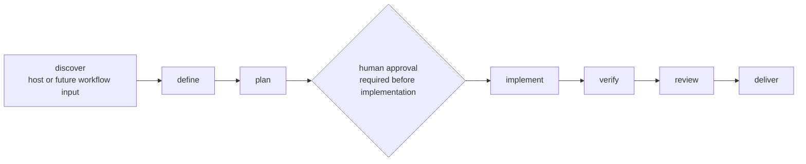

# Wingstaff documentation

The Wingstaff bootstrap is a Hermes plugin that can register one read-only
pack-inspection tool, register one bundled skill, and validate one bundled
workflow pack. It does not execute workflows yet.

## Support status

| Document or surface | Status | Grounded by |
|---|---|---|
| [Architecture](01-architecture.md) | Implemented bootstrap boundary | `wingstaff/__init__.py`, `plugin.yaml`, `pyproject.toml`, plugin tests, Hermes plugin docs |
| Workflow state (`02-workflow-state.md`) | Future — Phase 2; no file yet | Not implemented |
| [Pack reference](03-pack-reference.md) | Schema v1 implemented and unit-tested | `wingstaff/packs.py`, `wingstaff/packs/addyosmani.yaml`, pack tests |
| [Authoring packs](04-authoring-packs.md) | Implemented schema-v1 authoring path | Pack loader, bundled pack, pack tests |
| Lifecycle stages (`05-lifecycle-stages.md`) | Future — Phase 5; no file yet | Workflow execution not implemented |
| [Security](06-security.md) | Current package and plugin boundary | Manifest, registration, pack loader, tool handler, Hermes plugin docs |
| Runbook (`07-runbook.md`) | Future — Phase 8; no file yet | Operator CLI not implemented |
| Hermes integration (`08-hermes-integration.md`) | Future — Phase 1; no file yet | Live installation not verified |
| Pack adapters (`09-pack-adapters.md`) | Future — Phase 5; no file yet | Adapter execution not implemented |
| `wingstaff_pack_info` | Implemented and unit-tested through a fake plugin context | `wingstaff/schemas.py`, `wingstaff/tools.py`, `tests/test_plugin.py` |
| `wingstaff:orchestrate` | Bundled and registration-tested; procedure is not an execution engine | `wingstaff/skills/orchestrate/SKILL.md`, `tests/test_plugin.py` |
| `wingstaff packs validate addyosmani` | Implemented diagnostics command | `wingstaff/cli.py` |
| Workflow execution, persistence, approval tools, Kanban, cron, delivery | Unavailable | Planned in the [roadmap](plans/2026-07-10-wingstaff-bootstrap-and-roadmap.md) |

“Implemented” means present in this repository. “Unit-tested” does not mean the
plugin has passed a live Hermes installation test; Phase 1 owns that proof.

## Reading order

1. [Architecture](01-architecture.md) — process and component boundaries.
2. [Pack reference](03-pack-reference.md) — the exact implemented schema.
3. [Authoring packs](04-authoring-packs.md) — how to add another schema-v1 pack.
4. [Security](06-security.md) — current trust boundary and controls not yet present.
5. [Implementation roadmap](plans/2026-07-10-wingstaff-bootstrap-and-roadmap.md) — future phases.

## Lifecycle

The pack-neutral target lifecycle includes discovery and an explicit gate. The
schema-v1 pack stores the six skill-bearing stages and the gate
position; discovery is not represented as a stage and nothing executes them.



## Find the right document

| Symptom or question | Read |
|---|---|
| Is Wingstaff a separate service? | [Architecture](01-architecture.md#process-boundary) |
| What does a schema-v1 pack file accept? | [Pack reference](03-pack-reference.md) |
| How do I add a pack without branching the engine? | [Authoring packs](04-authoring-packs.md) |
| Does the bootstrap enforce approval or execute skills? | [Security](06-security.md#human-approval-boundary) |
| Where are install, run, resume, and recovery commands? | Not published yet; the runbook is a Phase 8 deliverable |
| Which future phase owns a missing surface? | [Implementation roadmap](plans/2026-07-10-wingstaff-bootstrap-and-roadmap.md) |

## Verification

Check all repository Markdown links and anchors with:

```bash
python scripts/check_md_links.py .
```

The repository-wide verification gate is defined in [`/AGENTS.md`](../AGENTS.md).
