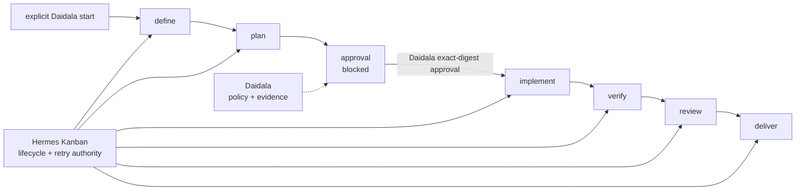

# Daidala documentation

Daidala adds pack provenance, persisted skill activation, digest-bound
approval, Git isolation, and durable evidence to Hermes Kanban. Hermes owns card
status, dependencies, assignment, retries, comments, and worker runs; Daidala
owns only its policy and artifact integrity boundary.

New operators should start with [Getting started](00-getting-started.md), not the
architecture references.

## Support status

| Document or surface | Status | Grounded by |
|---|---|---|
| [Getting started](00-getting-started.md) | Native first-workflow path verified on Hermes v0.18.2 and v0.19.0 | Isolated native lifecycle probe and CLI tests |
| [Architecture](01-architecture.md) | In-process policy adapter and Kanban authority split implemented | Runtime modules, graph tests, and isolated Hermes probes |
| [Policy ledger](02-workflow-state.md) | Status-free ledger and combined live Kanban diagnostics implemented | State, store, service, Kanban, and persistence tests |
| [Pack reference](03-pack-reference.md) | Schema-v1 providers and required/conditional activation implemented | Pack loader, bundled YAML, and pack tests |
| [Authoring packs](04-authoring-packs.md) | Pack-neutral mapping and activation authoring implemented | Pack loader and cross-pack tests |
| [Lifecycle stages](05-lifecycle-stages.md) | Approval graph, host-bound activation authorization, pending/finalized recovery, fail-closed evidence gates, and handoffs implemented | Graph, activation, worker-contract, and recovery tests |
| [Security](06-security.md) | Approval, activation, worktree, artifact, secrets, and supply-chain boundaries implemented | Runtime and release-content tests |
| [Runbook](07-runbook.md) | Native lifecycle and normal Kanban recovery commands verified | Shared CLI tests and isolated Hermes lifecycle probe |
| [Hermes integration](08-hermes-integration.md) | Exact Hermes v0.18.2 and v0.19.0 hosts supported within `>=0.18.2,<0.20.0` | Isolated repeated exact-wheel probes, compatible comparison, and release-only compatibility regression |
| [Pack adapters](09-pack-adapters.md) | Addyosmani and AI-DLC mappings and activation modes implemented | Pack YAML, bundled adapter, and cross-pack execution tests |
| [Autonomous development use cases](10-autonomous-development-use-cases.md) | Current use cases, activation handoffs, user controls, tutorial ideas, and unsupported opportunities documented | Runtime contracts plus external agent-development research |
| [Skill usage and user control](11-skill-usage-and-user-control.md) | Candidate loading, persisted activation, structured handoff, and user-selection boundaries documented | Pack, policy ledger, worker contract, and cross-pack tests |
| [Workflow ecosystem market overview](12-market-overview.md) | Current projects evaluated as packs, interoperability layers, optional tools, or product references | Upstream documentation, local Matt Pocock Skills checkout, and Daidala pack contracts |
| [Autonomous triggering](13-autonomous-triggering.md) | Hermes cron/webhook composition documented but not exercised end to end; implementation still requires exact-digest approval | Observed Hermes v0.18.2 CLI plus Daidala start CLI and tool schemas |
| [Workflow constraints](14-workflow-constraints.md) | Implemented; workflow-scoped policy invariants, approval binding, replacement, and exact skill-backed reusable sources | `daidala/constraints.py`, `daidala/service.py`, and constraint regressions |
| [Autonomous self-improvement flow](15-self-improvement.md) | Phases 1-4 implemented and repository-tested, including prerequisite diagnosis, admission coordination, evaluator/comparison evidence, and increment reconciliation; project onboarding, live adapters, attended cycle, retention, and publication remain blocked | Pure and fake-boundary tests, local evaluator fixtures, versioned result, and both implementation plans |
| [Self-improvement environment prerequisites](16-self-improvement-setup.md) | Complete reproducible setup/configuration and remediation guide with stable check IDs; revision, profile, Docker, credentials, gateway, and Project 1 exist, while plugin/board/bindings/Project fields/labels/receipts remain blocked | CLI parity and fail-closed tests, current non-secret host inventory, both implementation plans, and official Hermes, GitHub CLI, and Docker documentation |
| Target commit/push | Not part of Daidala runtime | Delivery records both flags as false |

“Implemented” means present in this repository. Compatibility claims are limited
to the host version and discovery paths in the
[Hermes integration guide](08-hermes-integration.md).

## Workflow and authority



Daidala creates the graph explicitly. The existing gateway's Kanban dispatcher
runs ready cards; Daidala adds no scheduler, daemon, dashboard server, or
polling loop. `/daidala` is an optional extension of the existing Hermes
dashboard. Generic Kanban unblock is interaction, not plan authorization.

Every executable card loads the complete exact pack-stage candidate set. After
`kanban_show`, its worker must persist a finalized, unblocked activation manifest
before applying methodology or submitting stage evidence. Successful handoffs
carry that manifest's digest and active skill names.

## Reading order

1. [Getting started](00-getting-started.md) — run the first workflow.
2. [Operator runbook](07-runbook.md) — operate, recover, cancel, and upgrade.
3. [Architecture](01-architecture.md) — understand the authority and process boundaries.
4. [Policy ledger](02-workflow-state.md) — understand durable Daidala facts.
5. [Lifecycle stages](05-lifecycle-stages.md) — inspect card inputs, handoffs, and blocks.
6. [Security](06-security.md) — review trust and Git boundaries.
7. [Pack reference](03-pack-reference.md) and [authoring guide](04-authoring-packs.md) — build adapters.
8. [Pack adapters](09-pack-adapters.md) — inspect the shipped mappings.
9. [Hermes integration](08-hermes-integration.md) — inspect verified host behavior.
10. [Autonomous development use cases](10-autonomous-development-use-cases.md) — choose suitable work, steer skills, and assess current limitations.
11. [Skill usage and user control](11-skill-usage-and-user-control.md) — understand how packs become card skills and which controls remain with the user.
12. [Workflow ecosystem market overview](12-market-overview.md) — compare candidate skill sets, workflow standards, design systems, and adjacent products.
13. [Autonomous triggering](13-autonomous-triggering.md) — admit GitHub, Linear, Jira, or scheduled work without adding a Daidala scheduler or bypassing approval.
14. [Workflow constraints](14-workflow-constraints.md) — define durable workflow policy without turning constraints into methodology.
15. [Autonomous self-improvement flow](15-self-improvement.md) — understand the
    Phase 2 admission, identities, authority, document provenance, planned live flow, and
    Daidala dogfood cases.
16. [Self-improvement environment prerequisites](16-self-improvement-setup.md) —
    reproduce, provision, and verify the controller, credentials, board, GitHub,
    gateway, trusted evidence, and restricted evaluator boundary before a live
    cycle; use the checker only as a completeness confirmation for this guide.

## Find the right document

| Question or symptom | Read |
|---|---|
| How do I start and approve the first workflow? | [Getting started](00-getting-started.md) |
| Is Daidala a separate service or scheduler? | [Architecture](01-architecture.md#process-boundary) |
| Who owns status and retries? | [Policy ledger](02-workflow-state.md) |
| Why is Kanban unblock not approval? | [Security](06-security.md#human-approval-boundary) |
| What must each worker record? | [Lifecycle stages](05-lifecycle-stages.md) |
| Why is a loaded skill not necessarily active? | [Skill usage and user control](11-skill-usage-and-user-control.md#what-using-a-skill-means) |
| How do I recover a blocked card? | [Operator runbook](07-runbook.md#recovery) |
| Which Hermes version and commands are verified? | [Hermes integration](08-hermes-integration.md) |
| How do packs change stage workers without engine branches? | [Authoring packs](04-authoring-packs.md) |
| Which autonomous-development tasks fit, how do skills hand off, and where can I intervene? | [Autonomous development use cases](10-autonomous-development-use-cases.md) |
| What does “using” a pack skill mean, and can I select or override stage skills? | [Skill usage and user control](11-skill-usage-and-user-control.md) |
| Which external projects could become Daidala packs, and why do others not fit? | [Workflow ecosystem market overview](12-market-overview.md) |
| How can GitHub issues, Actions failures, Linear tickets, Jira tickets, or cron start a workflow? | [Autonomous triggering](13-autonomous-triggering.md) |
| How can one workflow enforce durable policy without creating another skill layer? | [Workflow constraints](14-workflow-constraints.md#policy-is-not-methodology) |
| How does the autonomous self-improvement controller, evaluator, approval, evidence, and recovery flow work? | [Autonomous self-improvement flow](15-self-improvement.md) |
| What must I install and configure before the self-improvement tests can run live? | [Self-improvement environment prerequisites](16-self-improvement-setup.md) |

## Verification

```bash
python scripts/check_md_links.py .
```

The repository-wide gate is defined in [`/AGENTS.md`](../AGENTS.md).
