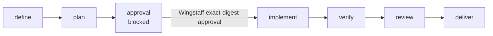

# Wingstaff documentation

Wingstaff is a Hermes plugin that maps exact-skill workflow packs onto Hermes
Kanban. Hermes owns operational state; Wingstaff owns digest-bound approval,
repository safety, artifact integrity, and evidence-backed uncommitted delivery.

## Support status

| Document or surface | Status | Grounded by |
|---|---|---|
| [Architecture](01-architecture.md) | Policy ledger and full approval-gated Kanban graph implemented | Runtime modules, fake-host graph tests, and isolated Hermes probe |
| [Policy ledger and Kanban state](02-workflow-state.md) | Policy ledger and read-only combined Kanban status implemented | `wingstaff/state.py`, `wingstaff/store.py`, `wingstaff/kanban.py`, policy, persistence, and graph tests |
| [Pack reference](03-pack-reference.md) | Schema v1 external and bundled skill references implemented | `wingstaff/packs.py`, bundled pack YAML, pack tests |
| [Authoring packs](04-authoring-packs.md) | Implemented schema-v1 authoring path | Pack loader, bundled pack, pack tests |
| [Lifecycle stages](05-lifecycle-stages.md) | Approval-gated Kanban graph implemented; worker handoffs pending | Graph adapter tests and isolated Hermes host probe |
| [Security](06-security.md) | Release-hardened plugin, approval, artifact, worktree, and supply-chain boundary | Runtime modules, release-content checker, dependency audit, and tests |
| [Runbook](07-runbook.md) | Install and pack diagnostics implemented; Kanban-native workflow commands pending | Shared CLI tests and isolated Hermes command probe |
| [Hermes integration](08-hermes-integration.md) | Compatibility matrix verified for Hermes v0.18.2 | Isolated directory, wheel-entry-point, public Git, CLI, and Kanban probes |
| [Pack adapters](09-pack-adapters.md) | Addyosmani and AI-DLC v1.0.1 implemented | Pack YAML, bundled adapter skill, execution tests |
| Wingstaff plugin tools | Kanban-native operator/model and scoped evidence tools implemented | `wingstaff/schemas.py`, `wingstaff/tools.py`, plugin and graph tests |
| `wingstaff:orchestrate` | Bundled executable procedure | `wingstaff/skills/orchestrate/SKILL.md`, plugin and installation tests |
| `hermes wingstaff` and standalone `wingstaff` | Shared operator parser and handlers implemented | `wingstaff/cli.py`, plugin and CLI-equivalence tests |
| Approval-gated full Kanban graph | Implemented | `wingstaff/kanban.py`, `wingstaff/service.py`, fake-host tests, and isolated Hermes host probe |
| Cron and target commit/push | Unavailable | Planned in the [roadmap](plans/2026-07-10-wingstaff-bootstrap-and-roadmap.md) |
| Release CI and package audit | Implemented | `.github/workflows/release.yml`, release-content tests, build, Twine, and `pip-audit` |

“Implemented” means present in this repository. Live installation claims are
limited to the Hermes version and discovery paths recorded in the
[Hermes integration guide](08-hermes-integration.md).

## Reading order

1. [Architecture](01-architecture.md) — process and component boundaries.
2. [Policy ledger and Kanban state](02-workflow-state.md) — authority and integrity facts.
3. [Pack reference](03-pack-reference.md) — the exact implemented schema.
4. [Authoring packs](04-authoring-packs.md) — add a schema-v1 pack.
5. [Lifecycle stages](05-lifecycle-stages.md) — executable inputs and outputs.
6. [Security](06-security.md) — current trust and execution boundaries.
7. [Hermes integration](08-hermes-integration.md) — verified host boundaries.
8. [Pack adapters](09-pack-adapters.md) — implemented external mappings.
9. [Implementation roadmap](plans/2026-07-10-wingstaff-bootstrap-and-roadmap.md) — future phases.

## Lifecycle

The pack-neutral target lifecycle is a Hermes Kanban graph with an explicit
blocked approval card. Hermes owns card progress and recovery; Wingstaff checks
the exact plan digest before creating or releasing implementation-capable work.



## Find the right document

| Symptom or question | Read |
|---|---|
| Is Wingstaff a separate service? | [Architecture](01-architecture.md#process-boundary) |
| What does a schema-v1 pack file accept? | [Pack reference](03-pack-reference.md) |
| How do I add a pack without branching the engine? | [Authoring packs](04-authoring-packs.md) |
| How is approval enforced before implementation? | [Security](06-security.md#human-approval-boundary) |
| What does each executable stage require? | [Lifecycle stages](05-lifecycle-stages.md) |
| Which Hermes version and installation paths are verified? | [Hermes integration](08-hermes-integration.md) |
| Where are install, run, resume, and recovery commands? | [Operator runbook](07-runbook.md) |
| Which future phase owns a missing surface? | [Implementation roadmap](plans/2026-07-10-wingstaff-bootstrap-and-roadmap.md) |

## Verification

Check all repository Markdown links and anchors with:

```bash
python scripts/check_md_links.py .
```

The repository-wide verification gate is defined in [`/AGENTS.md`](../AGENTS.md).
