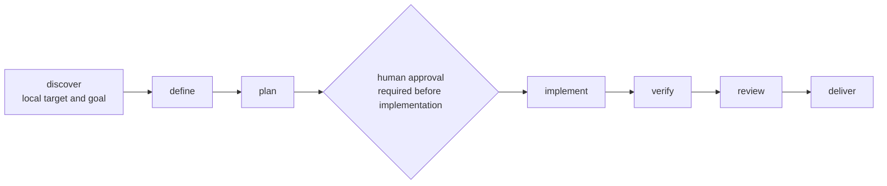

# Wingstaff documentation

Wingstaff is a Hermes plugin with deterministic workflow state, exact-skill
gates, digest-bound approval, profile-local persistence, detached Git
worktrees, and evidence-backed uncommitted delivery for one bundled pack.

## Support status

| Document or surface | Status | Grounded by |
|---|---|---|
| [Architecture](01-architecture.md) | Implemented plugin and execution boundary | Runtime modules, plugin tests, Hermes plugin docs |
| [Workflow state](02-workflow-state.md) | Implemented and persisted | `wingstaff/state.py`, `wingstaff/workflow.py`, `wingstaff/store.py` |
| [Pack reference](03-pack-reference.md) | Schema v1 implemented and unit-tested | `wingstaff/packs.py`, `wingstaff/packs/addyosmani.yaml`, pack tests |
| [Authoring packs](04-authoring-packs.md) | Implemented schema-v1 authoring path | Pack loader, bundled pack, pack tests |
| [Lifecycle stages](05-lifecycle-stages.md) | Thin executable Addyosmani workflow implemented | `wingstaff/service.py`, `wingstaff/execution.py`, `tests/test_execution.py` |
| [Security](06-security.md) | Current plugin, approval, artifact, and worktree boundary | Runtime modules and tests |
| Runbook (`07-runbook.md`) | Future — Phase 8; no file yet | Operator CLI not implemented |
| [Hermes integration](08-hermes-integration.md) | Verified against Hermes v0.18.2 | Isolated directory and wheel-entry-point probes, `tests/test_installation.py` |
| [Pack adapters](09-pack-adapters.md) | Addyosmani implemented; AI-DLC future | Pack YAML, pack/skill/execution tests |
| Wingstaff plugin tools | Twelve strict JSON tools implemented | `wingstaff/schemas.py`, `wingstaff/tools.py`, plugin and execution tests |
| `wingstaff:orchestrate` | Bundled executable procedure | `wingstaff/skills/orchestrate/SKILL.md`, plugin and installation tests |
| `wingstaff packs validate addyosmani` | Implemented diagnostics command | `wingstaff/cli.py` |
| Kanban, cron, skill installation, target commit/push | Unavailable | Planned in the [roadmap](plans/2026-07-10-wingstaff-bootstrap-and-roadmap.md) |

“Implemented” means present in this repository. Live installation claims are
limited to the Hermes version and discovery paths recorded in the
[Hermes integration guide](08-hermes-integration.md).

## Reading order

1. [Architecture](01-architecture.md) — process and component boundaries.
2. [Workflow state](02-workflow-state.md) — durable statuses and transitions.
3. [Pack reference](03-pack-reference.md) — the exact implemented schema.
4. [Authoring packs](04-authoring-packs.md) — add a schema-v1 pack.
5. [Lifecycle stages](05-lifecycle-stages.md) — executable inputs and outputs.
6. [Security](06-security.md) — current trust and execution boundaries.
7. [Hermes integration](08-hermes-integration.md) — verified host boundaries.
8. [Pack adapters](09-pack-adapters.md) — implemented external mappings.
9. [Implementation roadmap](plans/2026-07-10-wingstaff-bootstrap-and-roadmap.md) — future phases.

## Lifecycle

The pack-neutral target lifecycle includes discovery and an explicit gate.
Hermes drives each stage through Wingstaff's registered tools; Wingstaff
persists outputs and enforces the transition order.



## Find the right document

| Symptom or question | Read |
|---|---|
| Is Wingstaff a separate service? | [Architecture](01-architecture.md#process-boundary) |
| What does a schema-v1 pack file accept? | [Pack reference](03-pack-reference.md) |
| How do I add a pack without branching the engine? | [Authoring packs](04-authoring-packs.md) |
| How is approval enforced before implementation? | [Security](06-security.md#human-approval-boundary) |
| What does each executable stage require? | [Lifecycle stages](05-lifecycle-stages.md) |
| Which Hermes version and installation paths are verified? | [Hermes integration](08-hermes-integration.md) |
| Where are install, run, resume, and recovery commands? | Not published yet; the runbook is a Phase 8 deliverable |
| Which future phase owns a missing surface? | [Implementation roadmap](plans/2026-07-10-wingstaff-bootstrap-and-roadmap.md) |

## Verification

Check all repository Markdown links and anchors with:

```bash
python scripts/check_md_links.py .
```

The repository-wide verification gate is defined in [`/AGENTS.md`](../AGENTS.md).
